# Intern Performance Prediction Using Machine Learning


---

## Table of Contents

- Project Overview
- Problem Statement
- Project Objectives
- Dataset Information
- Dataset Overview
- Dataset Features
- Required Libraries
- Project Structure
- Machine Learning Workflow
- Data Cleaning
- Exploratory Data Analysis
- Correlation Analysis
- Relationship Analysis
- Data Preprocessing
- Feature Engineering
- Feature Selection
- Train-Test Split
- Logistic Regression
- Decision Tree Classifier
- Random Forest Classifier
- Model Evaluation
- Classification Reports
- Confusion Matrices
- Model Comparison
- Saving Trained Models
- Loading Saved Models
- Making Predictions
- Results
- Technologies Used
- Installation
- Requirements
- Repository Contents
- Future Improvements
- Conclusion
- Author

---

# Project Overview

Intern performance evaluation plays an important role in measuring learning progress, engagement, and overall internship success. As internship programs continue to grow, manually assessing thousands of interns becomes increasingly difficult, time-consuming, and inconsistent.

This project develops a complete Machine Learning pipeline capable of predicting intern performance using internship-related information, including attendance percentage, task completion, mentor interactions, demographic information, educational background, and mentor feedback.

The project follows an end-to-end machine learning workflow beginning with data understanding and preprocessing, followed by exploratory data analysis, feature engineering, model development, evaluation, and prediction.

Three supervised machine learning algorithms are implemented and compared:

- Logistic Regression
- Decision Tree Classifier
- Random Forest Classifier

The trained models are saved using Joblib, allowing future predictions without retraining the models.

---

# Problem Statement

Organizations often manage thousands of interns across multiple departments and internship tracks. Evaluating intern performance manually can be inefficient and may lead to inconsistent assessments.

The objective of this project is to develop a machine learning model capable of predicting intern performance based on measurable engagement indicators such as attendance percentage, task completion, mentor interactions, and feedback scores. The resulting model can assist mentors in monitoring intern progress, identifying interns who may require additional support, and making data-driven decisions throughout the internship program.

---

# Project Objectives

The primary objectives of this project are:

- Understand the internship performance dataset.
- Perform data cleaning and preprocessing.
- Explore relationships between internship-related features.
- Analyze numerical and categorical variables.
- Perform exploratory data analysis using statistical visualizations.
- Prepare the dataset for machine learning.
- Encode categorical variables.
- Split the dataset into training and testing sets.
- Train multiple machine learning classification models.
- Evaluate model performance using multiple evaluation metrics.
- Compare different classification algorithms.
- Save trained machine learning models.
- Load trained models for future predictions.
- Predict the performance status of new interns.

---

# Dataset Information

The project uses an internship performance dataset representing interns enrolled in multiple departments and internship tracks during **2025**.

The dataset contains demographic information, educational background, internship progress, attendance records, mentor interactions, completed tasks, mentor feedback, and the final performance status of each intern.

The target variable of this project is:

**Performance_Status**

which represents the final performance category assigned to each intern.

---

# Dataset Overview

| Attribute | Description |
|-----------|-------------|
| Dataset Name | Intern Performance Dataset |
| File Name | intern_performance_2025.csv |
| Domain | Internship Performance Analytics |
| Problem Type | Multi-Class Classification |
| Objective | Predict Intern Performance |
| Target Variable | Performance_Status |
| Total Records | 70,000 |
| Total Features | 20 |
| File Format | CSV |

---

# Dataset Features

| Feature | Description |
|---------|-------------|
| Intern_ID | Unique identifier assigned to each intern |
| Intern_Name | Name of the intern |
| Gender | Gender of the intern |
| Age | Age of the intern |
| City | City of residence |
| Education | Educational qualification |
| Institute | Educational institute |
| Department | Internship department |
| Internship_Track | Internship specialization |
| Mentor_ID | Unique mentor identifier |
| Mentor_Name | Assigned mentor |
| Enrollment_Date | Internship enrollment date |
| Internship_Duration_Weeks | Total internship duration |
| Weeks_Completed | Completed internship weeks |
| Attendance_Percentage | Attendance percentage |
| Tasks_Assigned | Total assigned tasks |
| Tasks_Submitted | Completed tasks |
| Mentor_Interactions | Number of mentor interactions |
| Feedback_Score | Mentor feedback score |
| Performance_Status | Target variable |

---

# Required Libraries

The following Python libraries were used throughout the project.

| Library | Purpose |
|----------|---------|
| Pandas | Data manipulation and analysis |
| NumPy | Numerical computations |
| Matplotlib | Data visualization |
| Seaborn | Statistical visualization |
| Scikit-Learn | Machine learning algorithms and preprocessing |
| Joblib | Saving and loading trained models |

---

# Project Structure

```text
02-Intern-Performance-Prediction/
│
├── dataset/
│   ├── raw/
│   │   └── intern_performance_2025.csv
│   │
│   └── processed/
│       └── intern_performance_2025_ml_preprocessed.csv
│
├── models/
│   └── README.md
│
├── notebook/
│   └── Intern_Performance_Prediction.ipynb
│
├── outputs/
│   └── figures/
│       ├── 01_outlier_boxplots.png
│       ├── ...
│       ├── 21_Performance_Status_by_Gender.png
│       ├── logistic_regression_confusion_matrix.png
│       ├── decision_tree_confusion_matrix.png
│       └── random_forest_confusion_matrix.png
│
├── README.md
└── requirements.txt
```

---

# Machine Learning Workflow

The project follows a complete end-to-end machine learning workflow, beginning with raw internship data and ending with trained models capable of predicting intern performance.

```text
Raw Dataset
      │
      ▼
Load Dataset
      │
      ▼
Dataset Understanding
      │
      ▼
Data Cleaning
      │
      ▼
Data Validation
      │
      ▼
Outlier Detection
      │
      ▼
Exploratory Data Analysis (EDA)
      │
      ▼
Correlation Analysis
      │
      ▼
Relationship Analysis
      │
      ▼
Data Preprocessing
      │
      ▼
Feature Selection
      │
      ▼
Encoding
      │
      ▼
Train-Test Split
      │
      ▼
Model Training
      │
      ├──────────────► Logistic Regression
      │
      ├──────────────► Decision Tree
      │
      └──────────────► Random Forest
      │
      ▼
Model Evaluation
      │
      ▼
Classification Report
      │
      ▼
Confusion Matrix
      │
      ▼
Model Comparison
      │
      ▼
Save Models using Joblib
      │
      ▼
Load Saved Models
      │
      ▼
Predict New Intern Performance
```

---

# Data Cleaning

Data cleaning is one of the most important stages in the machine learning workflow. Before building predictive models, the internship dataset was carefully examined to ensure that it was complete, accurate, and suitable for analysis.

The cleaning process focused on validating data quality rather than making unnecessary modifications because the dataset was already well-structured.

The following validation checks were performed:

- Missing value detection
- Duplicate record detection
- Numerical feature validation
- Outlier detection

---

## Missing Values

The dataset was inspected to identify missing values across all features.

**Observation**

- No missing values were found.
- Every feature contains complete information.
- No imputation techniques were required.

---

## Duplicate Records

Duplicate records were checked to ensure that each internship record represents a unique intern.

**Observation**

- No duplicate records were detected.
- Every record in the dataset is unique.

---

## Numerical Feature Validation

The numerical variables were examined using descriptive statistics to verify that their values fall within realistic and expected ranges.

The following numerical features were validated:

- Age
- Attendance Percentage
- Tasks Submitted
- Mentor Interactions
- Feedback Score

**Observation**

The descriptive statistics confirmed that all numerical features contain valid values.

Examples include:

- Age ranges between **17 and 32 years**
- Attendance Percentage ranges from **40% to 100%**
- Tasks Submitted ranges from **3 to 8**
- Mentor Interactions ranges from **2 to 15**
- Feedback Score ranges from **1.2 to 5.0**

No unrealistic values were identified.

---

## Outlier Detection

Outliers were analyzed using boxplots for the numerical features.


<div align="center">

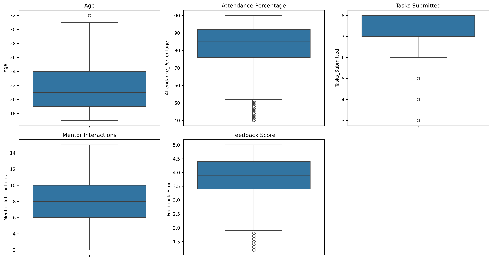

</div>

### Observation

The boxplots indicate that a small number of lower-end outliers exist in Attendance Percentage, Tasks Submitted, and Feedback Score. Age contains only a few upper-end outliers, while Mentor Interactions does not exhibit significant outliers.

These observations represent natural variations in intern performance rather than data quality issues. Therefore, no outlier treatment was applied, and the original dataset was retained for further analysis.

---

# Exploratory Data Analysis (EDA)

Exploratory Data Analysis (EDA) was performed to understand the characteristics of the internship performance dataset before developing machine learning models.

The analysis focuses on identifying patterns, distributions, correlations, and relationships among internship-related variables through statistical summaries and visualizations.

The EDA section includes:

- Target Variable Distribution
- Categorical Feature Analysis
- Numerical Feature Analysis
- Correlation Analysis
- Relationship Analysis

These analyses provide valuable insights into intern engagement, attendance, mentor interactions, feedback scores, and performance trends, helping build reliable machine learning models.

---

# Exploratory Data Analysis (EDA)

Exploratory Data Analysis (EDA) was performed to better understand the internship performance dataset before building machine learning models. This phase focuses on identifying data distributions, feature relationships, trends, and patterns through statistical summaries and visualizations.

The analysis helps reveal meaningful insights about intern engagement, attendance, mentor interactions, task completion, and overall performance, providing a strong foundation for model development.

The EDA section includes:

- Target Variable Distribution
- Categorical Feature Analysis
- Numerical Feature Analysis
- Correlation Analysis
- Relationship Analysis

---

# Target Variable Distribution

The target variable (**Performance_Status**) was analyzed to understand how internship performance is distributed across the four performance categories. Examining the target distribution is important because it helps determine whether the dataset is balanced before training machine learning models.

<div align="center">

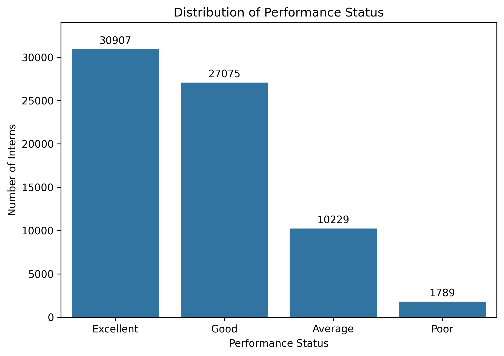

</div>

### Observation

The distribution of **Performance_Status** is imbalanced across the four performance categories.

- **Excellent** contains the highest number of internship records.
- **Good** represents the second largest category.
- **Average** includes considerably fewer interns.
- **Poor** contains the smallest number of records.

This distribution indicates that most interns achieved higher performance levels, while only a small percentage were classified as poor performers.

---

# Categorical Feature Analysis

Categorical features were analyzed to understand the composition of the internship dataset and identify how interns are distributed across different demographic and internship-related categories.

The following categorical variables were explored:

- Gender
- Department
- Internship Track
- Education
- City
- Institute

---

## Gender Distribution

The gender distribution provides an overview of male and female participation within the internship program.

<div align="center">

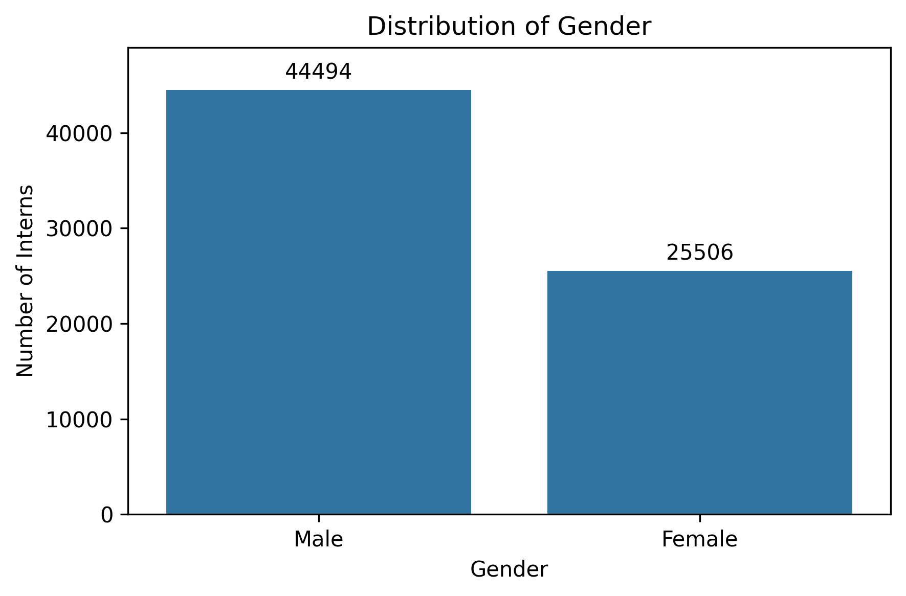

</div>

### Observation

The dataset contains a higher proportion of **male interns** compared to **female interns**.

Although both gender groups are well represented, the dataset is not perfectly balanced, with male interns accounting for the majority of internship records.

---

## Department Distribution

This visualization illustrates how interns are distributed across different internship departments.

<div align="center">

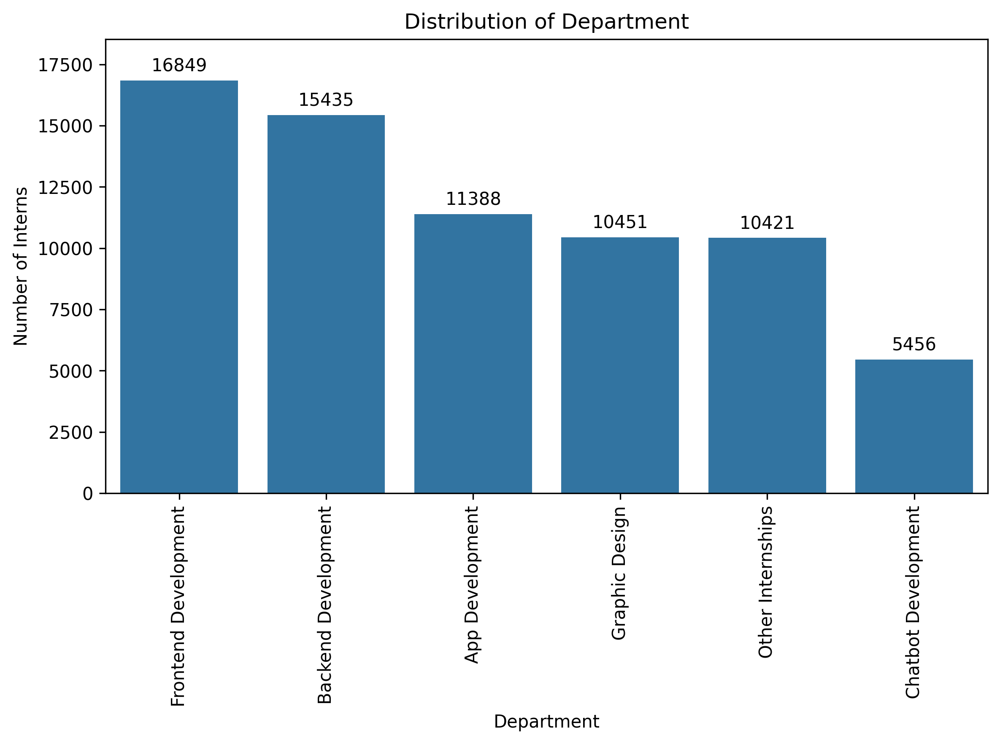

</div>

### Observation

Intern participation varies across departments.

- Frontend Development contains the highest number of interns.
- Backend Development is the second largest department.
- App Development, Graphic Design, and Other Internships maintain moderate participation.
- Chatbot Development contains the smallest number of interns.

Overall, interns are distributed across multiple departments, although participation levels differ.

---

## Internship Track Distribution

The internship track distribution illustrates participation across different technical specializations.

<div align="center">

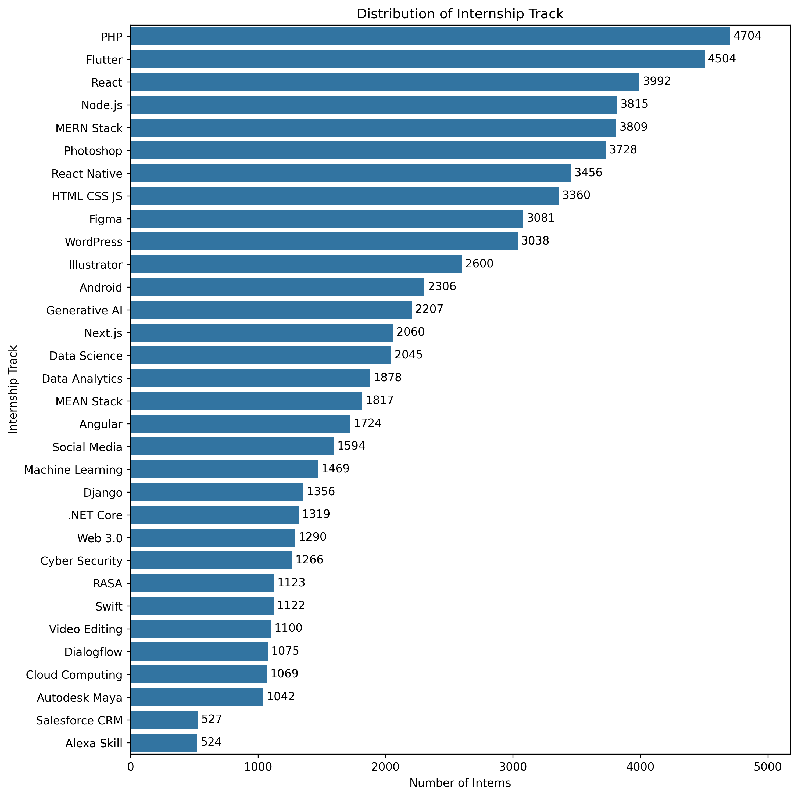

</div>

### Observation

Intern participation varies considerably among internship tracks.

Popular tracks such as **PHP**, **Flutter**, **React**, **Node.js**, and **MERN Stack** contain the largest number of interns, whereas specialized tracks have comparatively lower participation.

The dataset represents a diverse range of technical domains, making it suitable for comprehensive internship performance analysis.

---

## Education Distribution

The education distribution provides insight into the academic backgrounds of participating interns.

<div align="center">

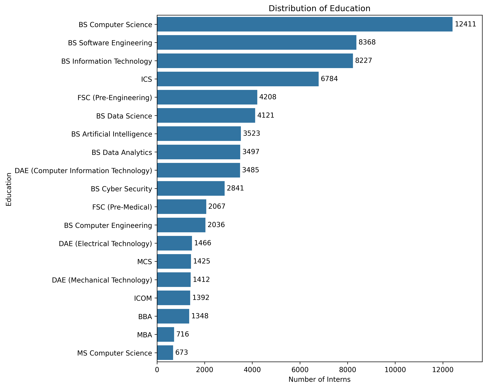

</div>

### Observation

Most interns belong to undergraduate computing-related programs.

BS Computer Science contributes the largest number of internship records, followed by Software Engineering and Information Technology programs.

The dataset also includes participants from Data Science, Artificial Intelligence, Data Analytics, Intermediate, Diploma, and postgraduate programs, demonstrating diverse educational backgrounds.

---

## City Distribution

The city distribution highlights the geographical representation of interns across Pakistan.

<div align="center">

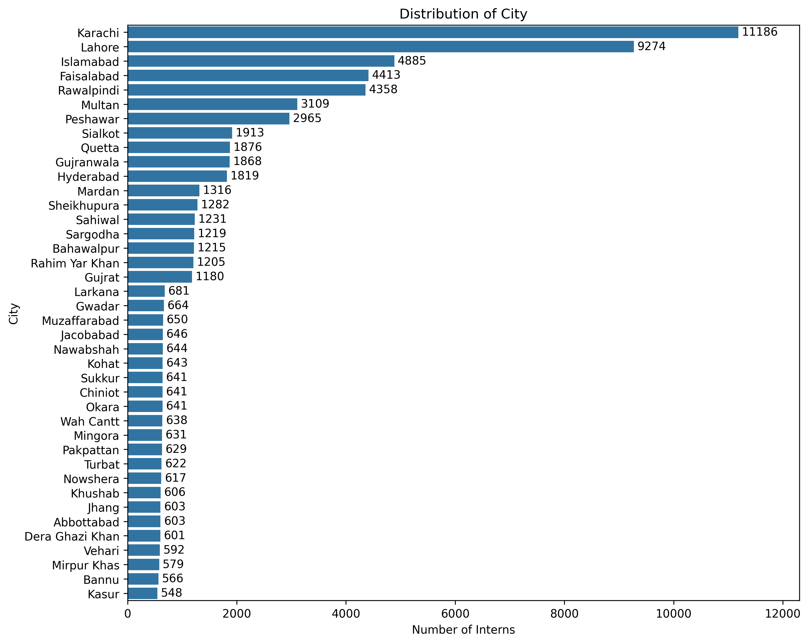

</div>

### Observation

The internship dataset includes participants from numerous cities across Pakistan.

Karachi and Lahore contribute the highest number of interns, followed by Islamabad, Faisalabad, Rawalpindi, Multan, and Peshawar.

This broad geographical coverage increases the diversity and representativeness of the dataset.

---

## Institute Distribution

This analysis shows the participation of interns from different educational institutions.

<div align="center">

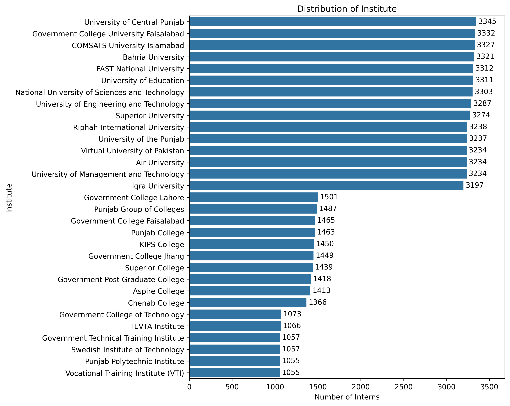

</div>

### Observation

Interns are drawn from a wide variety of universities, colleges, and technical institutes.

Participation is relatively balanced among major institutions, indicating that the dataset represents students from diverse educational backgrounds.

---

# Numerical Feature Analysis

Numerical features were analyzed to understand the distribution, spread, and variability of continuous variables within the internship dataset. Histograms combined with Kernel Density Estimation (KDE) curves were used to visualize the distribution of each numerical feature.

The following numerical variables were analyzed:

- Age
- Attendance Percentage
- Tasks Submitted
- Mentor Interactions
- Feedback Score

---

## Age Distribution

The age distribution illustrates the demographic composition of interns participating in the internship program.

<div align="center">

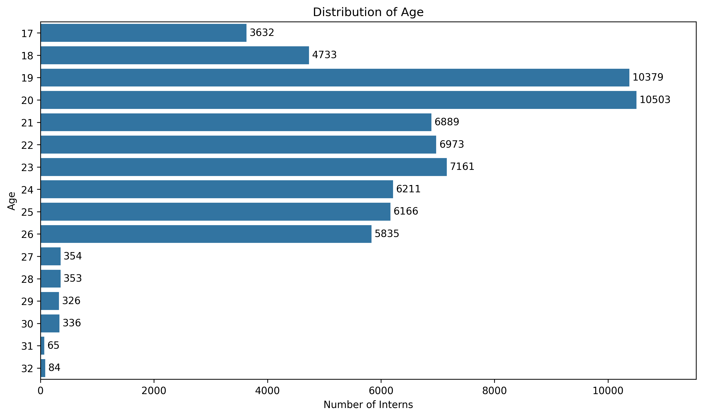

</div>

### Observation

The majority of interns fall within the typical university student age group.

- Most interns are between **20 and 25 years** old.
- Very few participants are below 18 or above 30 years of age.
- The distribution appears approximately normal with a slight right skew.

This indicates that the internship program primarily attracts undergraduate students and recent graduates.

---

## Attendance Percentage Distribution

Attendance percentage is one of the most important indicators of intern engagement throughout the internship.

<div align="center">

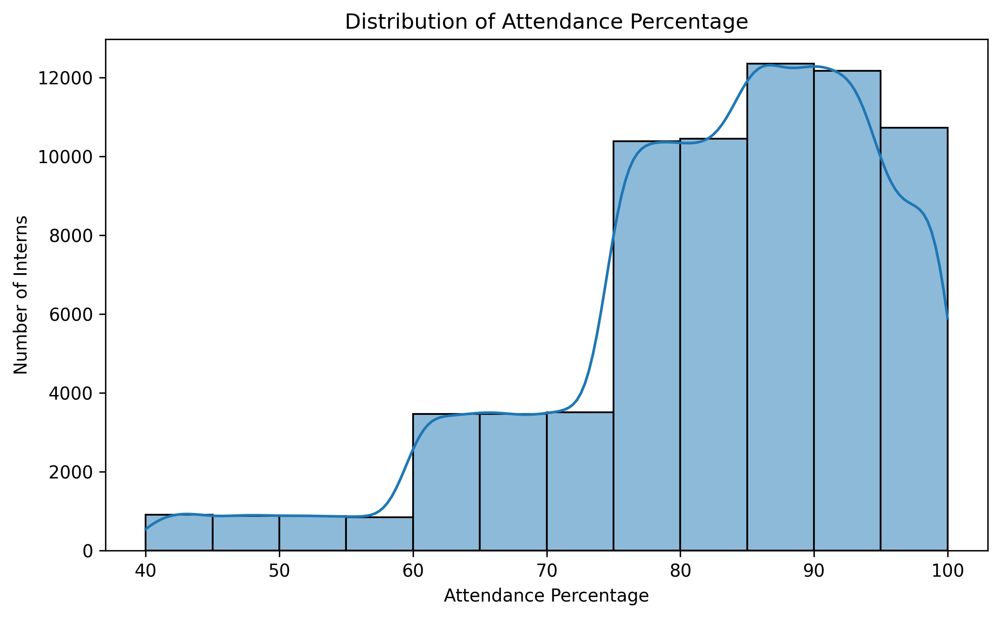

</div>

### Observation

Attendance percentages are concentrated toward the higher end of the scale.

- Most interns maintain attendance above **70%**.
- Relatively few interns have low attendance percentages.
- The distribution is negatively skewed, indicating generally strong attendance across the internship program.

High attendance suggests consistent participation by the majority of interns.

---

## Tasks Submitted Distribution

This visualization shows how many internship tasks were completed by participating interns.

<div align="center">

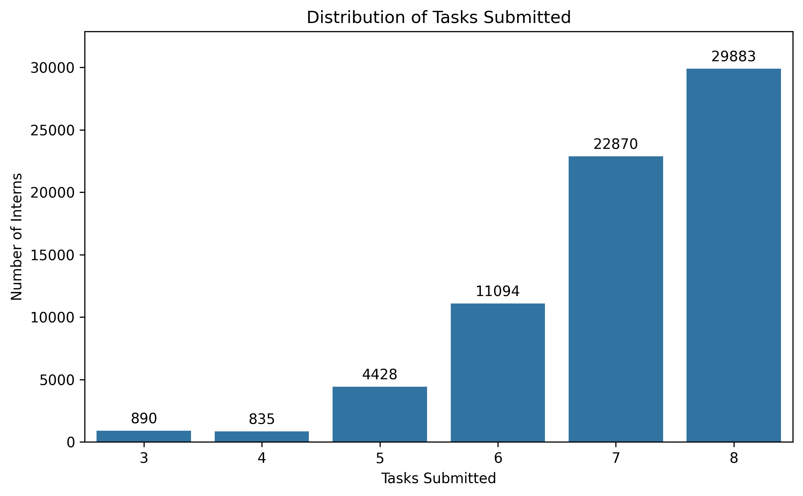

</div>

### Observation

Task submission levels are generally high.

- Most interns submitted a large proportion of their assigned tasks.
- Lower task submission counts are comparatively rare.
- The distribution indicates strong overall assignment completion among interns.

Task completion appears to be an important contributor to overall internship performance.

---

## Mentor Interactions Distribution

Mentor interaction measures how frequently interns communicated with their assigned mentors during the internship.

<div align="center">

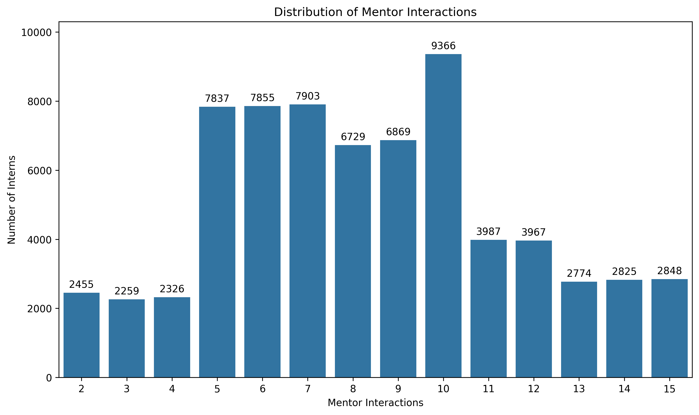

</div>

### Observation

The number of mentor interactions varies across interns.

- Most interns have a moderate number of mentor interactions.
- Extremely low and extremely high interaction counts are uncommon.
- The distribution suggests that regular mentor communication was maintained throughout the internship.

Mentor engagement plays an important role in monitoring intern progress and providing guidance.

---

## Feedback Score Distribution

Mentor feedback scores represent the qualitative assessment of intern performance throughout the internship.

<div align="center">

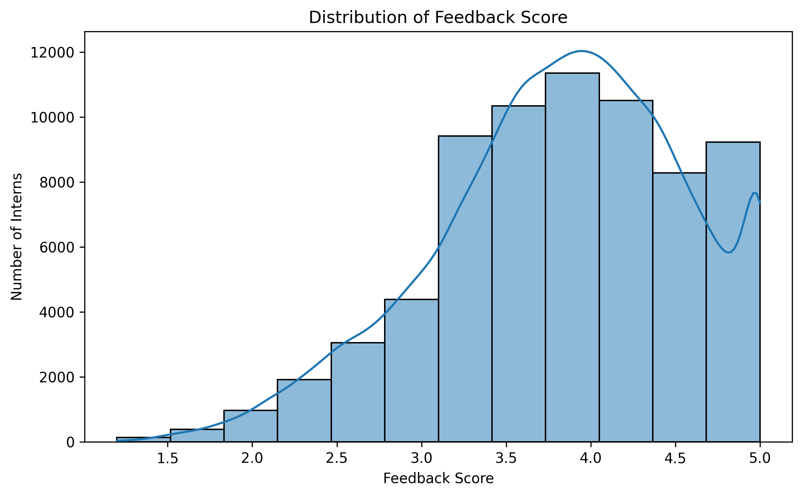

</div>

### Observation

Feedback scores are concentrated toward higher values.

- Most interns received positive mentor evaluations.
- Low feedback scores occur relatively infrequently.
- The distribution indicates that the majority of interns performed satisfactorily during the internship.

Overall, mentor feedback reflects a generally successful internship program.

---

# Summary of Numerical Feature Analysis

The numerical feature analysis reveals several important characteristics of the internship dataset.

- Most interns belong to the university-age population.
- Attendance percentages are generally high.
- Task submission rates indicate strong intern participation.
- Mentor interactions remain consistent across most interns.
- Feedback scores are predominantly positive.

These observations suggest that the dataset contains meaningful patterns that can effectively support machine learning models for predicting intern performance.

---

# Correlation Analysis

Correlation analysis was performed to measure the strength and direction of relationships among numerical features in the internship performance dataset.

A Pearson Correlation Heatmap was generated to identify how numerical variables are associated with one another and to determine which features contribute most to intern performance prediction.

<div align="center">

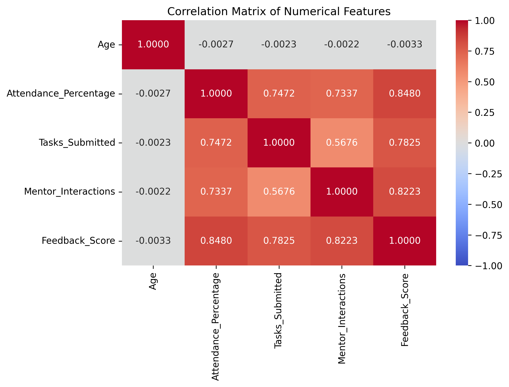

</div>

### Observation

The correlation heatmap reveals several meaningful relationships among the numerical features.

- Attendance Percentage, Tasks Submitted, Mentor Interactions, and Feedback Score are positively correlated with one another.
- Feedback Score exhibits one of the strongest positive relationships with other internship performance indicators.
- Attendance Percentage and Tasks Submitted also demonstrate a noticeable positive correlation.
- Age has comparatively weak correlations with the remaining numerical features.
- Overall, engagement-related features appear to be more influential than demographic characteristics.

These relationships suggest that attendance, task completion, mentor engagement, and feedback are valuable predictors for building machine learning models.

---

# Relationship Analysis

Relationship analysis was conducted to compare internship performance indicators across departments, internship tracks, educational backgrounds, and gender groups. The objective was to identify trends in average performance metrics and understand how intern performance varies among different categories.

---

## Average Feedback Score by Department

<div align="center">

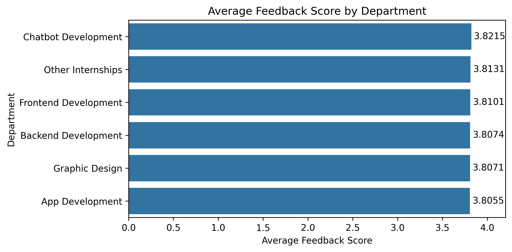

</div>

### Observation

The average mentor feedback score is highly consistent across all internship departments.

- Chatbot Development records the highest average feedback score.
- App Development records the lowest average feedback score.
- The variation between departments is very small.
- Overall, mentor evaluations remain fairly consistent across departments.

---

## Average Attendance Percentage by Internship Track

<div align="center">

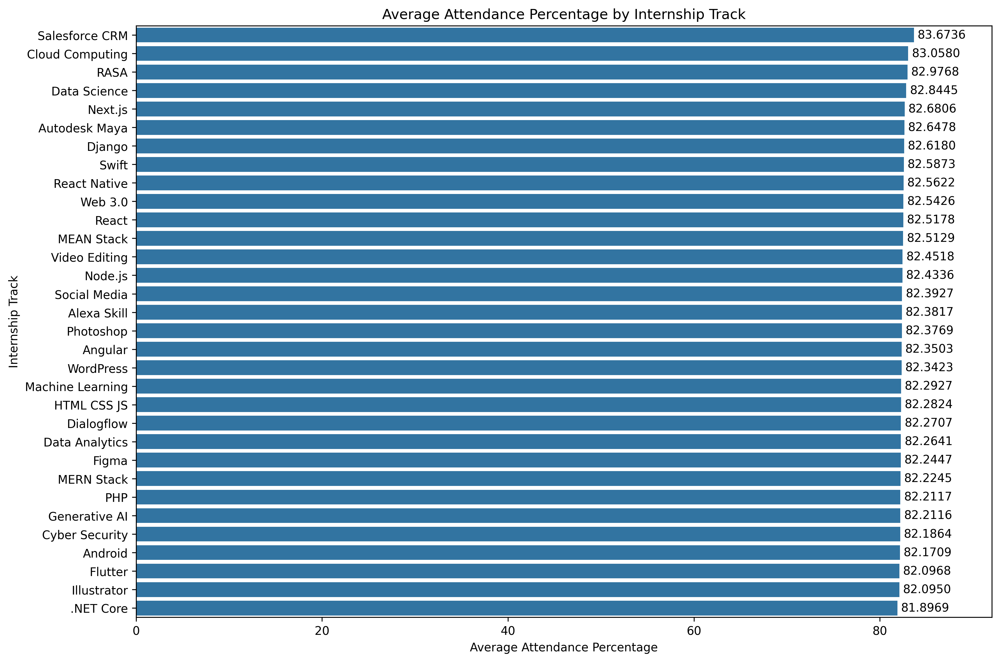

</div>

### Observation

Average attendance remains consistently high across all internship tracks.

- Salesforce CRM has the highest average attendance percentage.
- .NET Core has the lowest average attendance percentage.
- Every internship track maintains an average attendance above 80%.
- Attendance differences among tracks are relatively small.

---

## Average Tasks Submitted by Department

<div align="center">

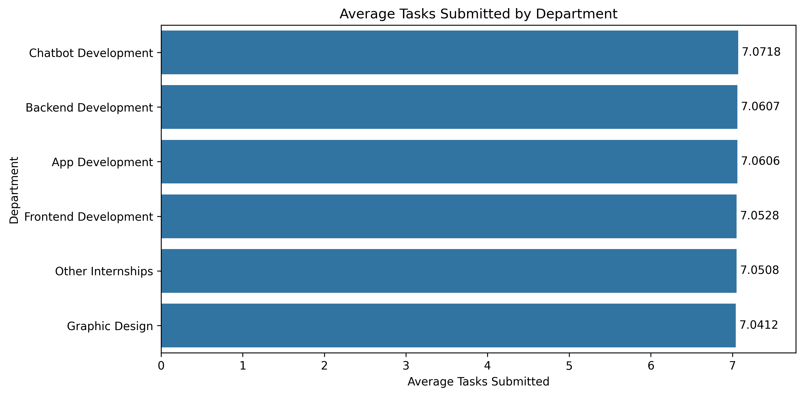

</div>

### Observation

Task submission rates remain nearly identical across departments.

- Chatbot Development has the highest average number of submitted tasks.
- Graphic Design records the lowest average task submission.
- Every department averages approximately seven completed tasks.
- The differences between departments are minimal.

---

## Average Mentor Interactions by Internship Track

<div align="center">

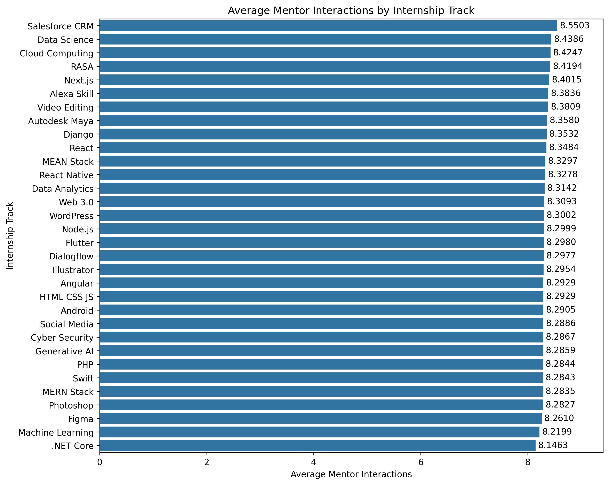

</div>

### Observation

Mentor interaction remains consistent across internship tracks.

- Salesforce CRM records the highest average mentor interactions.
- .NET Core records the lowest average mentor interactions.
- Differences between internship tracks are relatively small.
- Regular mentor communication is maintained across all specializations.

---

## Performance Status by Department

<div align="center">

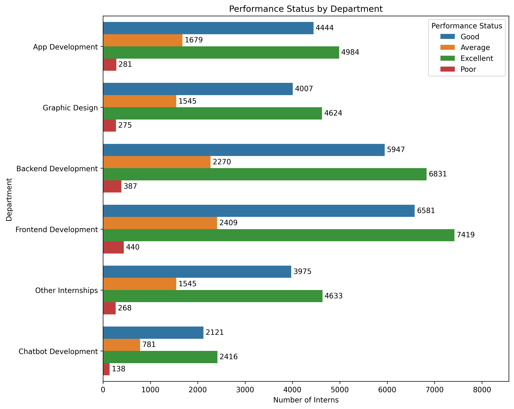

</div>

### Observation

The distribution of performance categories varies according to department.

- Excellent is the largest performance category across every department.
- Frontend Development contains the highest number of interns.
- Backend Development also contributes a large number of Excellent and Good performers.
- Poor performance represents the smallest category in every department.

---

## Performance Status by Education

<div align="center">

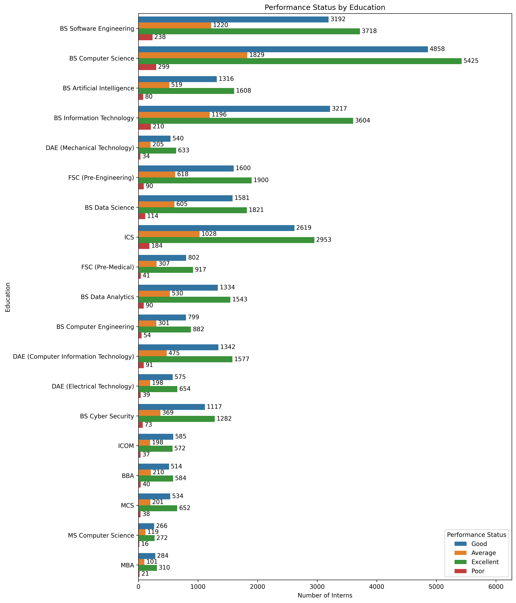

</div>

### Observation

Performance status was analyzed across different educational backgrounds.

- BS Computer Science contributes the largest number of internship participants.
- Excellent and Good remain the dominant performance categories across nearly every education level.
- Average and Poor categories contain comparatively fewer interns.
- The internship dataset includes undergraduate, diploma, intermediate, and postgraduate students.

---

## Performance Status by Gender

<div align="center">

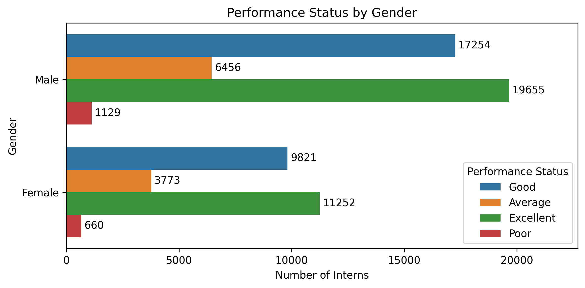

</div>

### Observation

Performance distribution remains similar across both gender groups.

- Excellent is the largest performance category for both male and female interns.
- Good is the second largest category.
- Average and Poor categories account for a smaller proportion of interns.
- Performance differences between genders are minimal.

---

# Summary of Exploratory Data Analysis

The exploratory data analysis provides several valuable insights into the internship performance dataset.

Key findings include:

- The dataset contains a balanced representation of demographic and internship-related features.
- Attendance Percentage remains consistently high across all internship tracks.
- Task submission rates are nearly identical among departments.
- Mentor Feedback Scores show very little variation across departments.
- Mentor interactions remain consistent regardless of internship specialization.
- Excellent is the most common performance category across departments, education levels, and gender groups.
- Good is the second most common performance category throughout the dataset.
- Poor performance accounts for only a small proportion of internship records.
- Engagement-related features such as attendance, task completion, mentor interactions, and feedback demonstrate stronger relationships than demographic variables.

These insights provide a solid foundation for the machine learning pipeline developed in the following sections, where multiple classification models are trained and evaluated to predict intern performance.

---

# Machine Learning Pipeline

After completing the exploratory data analysis, the dataset was prepared for machine learning by performing preprocessing, encoding categorical variables, selecting relevant features, and splitting the dataset into training and testing subsets.

The complete workflow ensures that the machine learning models are trained on clean, structured, and numerical data capable of producing reliable predictions.

The machine learning pipeline consists of the following stages:

- Data Preprocessing
- Feature Selection
- Encoding Categorical Variables
- Preparing Features and Target Variable
- Train-Test Split
- Model Training
- Model Evaluation
- Model Comparison
- Saving Trained Models
- Loading Saved Models
- Making Predictions

---

# Data Preprocessing

Before training the machine learning models, the internship dataset was preprocessed to ensure that it was suitable for supervised learning algorithms.

The preprocessing stage focused on transforming categorical variables into numerical representations while preserving all meaningful information contained within the dataset.

The following preprocessing steps were performed:

- Removal of unnecessary identifier columns
- Selection of relevant input features
- Separation of features and target variable
- Encoding categorical variables
- Encoding target labels
- Preparing the final machine learning dataset

The processed dataset was then used for model training and evaluation.

---

## Feature Selection

Not every column in the original dataset contributes to predicting intern performance.

Columns that simply identify interns or mentors do not provide meaningful predictive information and were therefore excluded from the machine learning process.

The remaining features describing intern demographics, internship progress, attendance, mentor engagement, educational background, and task completion were selected as predictor variables.

### Selected Input Features

- Gender
- Age
- City
- Education
- Institute
- Department
- Internship Track
- Internship Duration Weeks
- Weeks Completed
- Attendance Percentage
- Tasks Assigned
- Tasks Submitted
- Mentor Interactions
- Feedback Score

### Target Variable

The target variable used for classification is:

**Performance_Status**

This variable contains four performance categories:

- Excellent
- Good
- Average
- Poor

---

## Encoding Categorical Variables

Machine learning algorithms require numerical input; therefore, all categorical features were transformed into numerical representations before model training.

The following encoding techniques were applied.

### One-Hot Encoding

One-Hot Encoding was used for nominal categorical variables such as:

- Gender
- City
- Education
- Institute
- Department
- Internship Track

This technique converts each category into a separate binary feature without introducing ordinal relationships.

### Label Encoding

The target variable (**Performance_Status**) was converted into numerical labels using LabelEncoder.

This transformation allows classification algorithms to predict numerical labels while preserving the original performance categories.

---

## Preparing Features and Target Variable

The dataset was divided into two components.

### Input Features (X)

The input feature matrix (**X**) contains all selected predictor variables after preprocessing and encoding.

These variables represent intern demographics, internship participation, attendance, educational background, mentor engagement, and task completion.

### Target Variable (y)

The target vector (**y**) contains the encoded values of **Performance_Status**, representing the performance category to be predicted by the machine learning models.

---

## Train-Test Split

To evaluate the performance of the machine learning models on unseen data, the processed dataset was divided into training and testing subsets.

The dataset was split using Scikit-learn's **train_test_split()** function.

| Dataset | Percentage |
|---------|-----------:|
| Training Set | 80% |
| Testing Set | 20% |

The training set was used for learning model parameters, while the testing set was reserved exclusively for evaluating prediction performance.

Using separate datasets helps measure how well each model generalizes to new internship records and reduces the risk of overfitting.

---

# Machine Learning Models

Three supervised machine learning classification algorithms were implemented and compared throughout this project.

- Logistic Regression
- Decision Tree Classifier
- Random Forest Classifier

Each model was trained using the same processed dataset and evaluated using identical performance metrics, ensuring a fair comparison between algorithms.

The following evaluation techniques were used for every model:

- Accuracy Score
- Classification Report
- Confusion Matrix

These metrics provide a comprehensive understanding of model performance by measuring prediction accuracy, class-wise performance, precision, recall, and classification errors before selecting the most suitable model for intern performance prediction.

---

# Logistic Regression

Logistic Regression was implemented as the first supervised machine learning algorithm for predicting intern performance. It serves as a strong baseline classification model by estimating the probability of each performance category using the selected internship-related features.

The model was trained using the preprocessed training dataset and evaluated on unseen testing data to measure its predictive performance.

---

## Model Training

The Logistic Regression model was developed using Scikit-learn's `LogisticRegression` classifier.

During training, the algorithm learned the relationship between internship-related features and the target variable (**Performance_Status**) to classify interns into one of the four performance categories.

---

## Model Accuracy

The Logistic Regression model achieved an overall testing accuracy of **90.41%**.

This indicates that the model correctly classified approximately **9 out of every 10 internship records**, demonstrating excellent predictive capability for the internship performance dataset.

---

## Classification Report

The classification report evaluates the model using **Precision**, **Recall**, **F1-Score**, and **Support** for each performance class.

| Class | Precision | Recall | F1-Score | Support |
|------:|----------:|-------:|---------:|--------:|
| 0 | 0.92 | 0.89 | 0.91 | 2,046 |
| 1 | 0.92 | 0.92 | 0.92 | 6,181 |
| 2 | 0.88 | 0.89 | 0.88 | 5,415 |
| 3 | 0.91 | 0.94 | 0.93 | 358 |
| **Accuracy** | | | **0.90** | **14,000** |
| **Macro Average** | **0.91** | **0.91** | **0.91** | **14,000** |
| **Weighted Average** | **0.90** | **0.90** | **0.90** | **14,000** |

### Observation

The Logistic Regression model demonstrated excellent classification performance across all four performance categories.

- The model achieved an overall testing accuracy of **90.41%**.
- **Class 1** achieved the strongest overall performance with balanced Precision, Recall, and F1-Score of **0.92**.
- **Class 3** produced the highest Recall (**0.94**) and an excellent F1-Score of **0.93**.
- **Class 2** recorded the lowest F1-Score (**0.88**) but still maintained strong predictive performance.
- The **Macro Average (0.91)** indicates balanced performance across all performance classes.
- The **Weighted Average (0.90)** confirms that the model performs consistently across the complete testing dataset.

Overall, Logistic Regression provided highly reliable predictions and achieved the highest overall accuracy among the implemented machine learning models.

---

## Confusion Matrix

The confusion matrix compares the actual performance categories with the predicted categories generated by the Logistic Regression model.

<div align="center">


</div>

### Observation

The confusion matrix shows that the majority of internship records were classified correctly.

- Most predictions fall along the main diagonal, indicating correct classifications.
- Only a small number of internship records were misclassified.
- Misclassifications primarily occurred between similar performance categories.
- The confusion matrix confirms the model's strong predictive capability and balanced classification performance across all classes.

---

# Decision Tree Classifier

Decision Tree is a supervised machine learning algorithm that predicts intern performance by recursively splitting the dataset into decision nodes based on feature importance.

Its hierarchical tree structure makes the model easy to interpret while capturing nonlinear relationships between internship-related features and the target variable.

The model was trained using the same preprocessed dataset as the Logistic Regression model to ensure a fair comparison.

---

## Model Training

The Decision Tree classifier was implemented using Scikit-learn's `DecisionTreeClassifier`.

During training, the algorithm automatically learned decision rules from the internship dataset and constructed a tree-based model capable of classifying interns into the four performance categories.

---

## Model Accuracy

The Decision Tree model achieved an overall testing accuracy of **87.46%**.

This indicates that the model correctly classified approximately **87 out of every 100 internship records**. Although the model achieved good predictive performance, its overall accuracy was lower than that of the Logistic Regression model.

---

## Classification Report

The classification report evaluates the model using **Precision**, **Recall**, **F1-Score**, and **Support** for each performance class.

| Class | Precision | Recall | F1-Score | Support |
|------:|----------:|-------:|---------:|--------:|
| 0 | 0.88 | 0.89 | 0.88 | 2,046 |
| 1 | 0.90 | 0.89 | 0.90 | 6,181 |
| 2 | 0.84 | 0.85 | 0.84 | 5,415 |
| 3 | 0.89 | 0.91 | 0.90 | 358 |
| **Accuracy** | | | **0.87** | **14,000** |
| **Macro Average** | **0.88** | **0.88** | **0.88** | **14,000** |
| **Weighted Average** | **0.87** | **0.87** | **0.87** | **14,000** |

### Observation

The Decision Tree model demonstrated good classification performance across all four performance categories.

- The model achieved an overall testing accuracy of **87.46%**.
- **Class 1** and **Class 3** achieved the highest F1-Score (**0.90**).
- **Class 0** also performed well with an F1-Score of **0.88**.
- **Class 2** was comparatively more difficult to classify, producing the lowest F1-Score (**0.84**).
- The **Macro Average (0.88)** indicates balanced performance across all performance categories.
- The **Weighted Average (0.87)** confirms that the model maintained consistent classification performance across the complete testing dataset.

Overall, the Decision Tree classifier produced reliable predictions but achieved slightly lower predictive performance than the Logistic Regression model.

---

## Confusion Matrix

The confusion matrix compares the actual internship performance categories with the predictions generated by the Decision Tree model.

<div align="center">

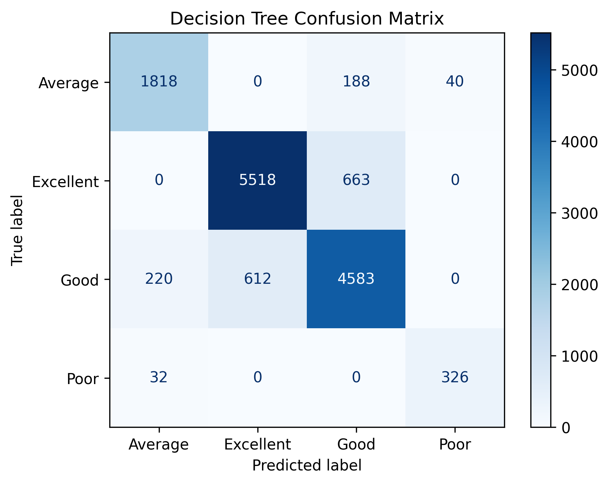

</div>

### Observation

The confusion matrix demonstrates that the majority of internship records were classified correctly.

- Most predictions appear along the main diagonal, indicating correct classifications.
- Some misclassification occurred between similar performance categories.
- Class 2 generated more prediction errors than the remaining classes.
- Overall, the confusion matrix confirms that the Decision Tree model provides good classification performance while remaining interpretable and easy to understand.

---


# Random Forest Classifier

Random Forest is an ensemble machine learning algorithm that combines multiple Decision Trees to improve prediction accuracy, reduce overfitting, and enhance model generalization.

Unlike a single Decision Tree, Random Forest aggregates the predictions of multiple trees using majority voting, resulting in a more robust and stable classification model.

The model was trained using the same preprocessed dataset to ensure a fair comparison with the Logistic Regression and Decision Tree models.

---

## Model Training

The Random Forest classifier was implemented using Scikit-learn's `RandomForestClassifier`.

During training, multiple decision trees were constructed using random subsets of both the training data and input features. The final prediction for each intern was determined through majority voting across all decision trees.

This ensemble approach improves prediction stability while reducing variance and overfitting.

---

## Model Accuracy

The Random Forest model achieved an overall testing accuracy of **89.89%**.

This indicates that the model correctly classified approximately **90 out of every 100 internship records**. The model demonstrated strong predictive performance and outperformed the Decision Tree classifier, although its accuracy was slightly lower than Logistic Regression.

---

## Classification Report

The classification report evaluates the model using **Precision**, **Recall**, **F1-Score**, and **Support** for each performance category.

| Class | Precision | Recall | F1-Score | Support |
|------:|----------:|-------:|---------:|--------:|
| 0 | 0.91 | 0.90 | 0.91 | 2,046 |
| 1 | 0.92 | 0.92 | 0.92 | 6,181 |
| 2 | 0.87 | 0.88 | 0.88 | 5,415 |
| 3 | 0.93 | 0.90 | 0.91 | 358 |
| **Accuracy** | | | **0.90** | **14,000** |
| **Macro Average** | **0.91** | **0.90** | **0.90** | **14,000** |
| **Weighted Average** | **0.90** | **0.90** | **0.90** | **14,000** |

### Observation

The Random Forest classifier demonstrated strong classification performance across all performance categories.

- The model achieved an overall testing accuracy of **89.89%**.
- **Class 1** achieved the strongest classification performance with Precision, Recall, and F1-Score of **0.92**.
- **Class 0** and **Class 3** also demonstrated excellent performance with F1-Scores of **0.91**.
- **Class 2** remained the most challenging category to classify, producing an F1-Score of **0.88**, which is still a strong result.
- The **Macro Average (0.90)** indicates balanced classification performance across all performance categories.
- The **Weighted Average (0.90)** confirms that the model maintained consistent predictive performance across the testing dataset.

Overall, the Random Forest classifier outperformed the Decision Tree model while achieving slightly lower overall accuracy than the Logistic Regression model.

---

## Confusion Matrix

The confusion matrix compares the actual internship performance categories with the predictions generated by the Random Forest model.

<div align="center">

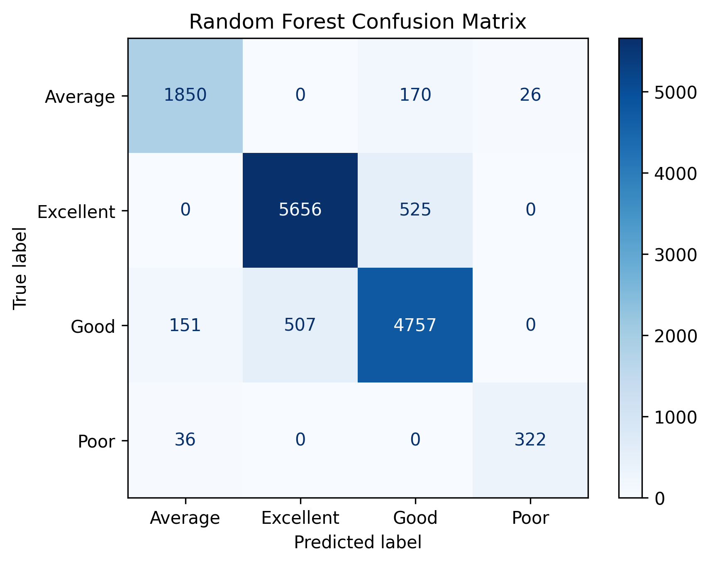

</div>

### Observation

The confusion matrix indicates excellent classification performance.

- Most internship records were correctly classified.
- The majority of predictions appear along the main diagonal, indicating high prediction accuracy.
- Misclassification errors are minimal and mainly occur between similar performance categories.
- The confusion matrix confirms that Random Forest produces reliable and balanced predictions across all classes.

---

# Model Comparison

The performance of all three machine learning models was compared using testing accuracy.

| Model | Accuracy |
|-----------------------|---------:|
| Logistic Regression | **90.41%** |
| Random Forest | **89.89%** |
| Decision Tree | **87.46%** |

### Observation

- Logistic Regression achieved the **highest overall accuracy (90.41%)**.
- Random Forest ranked second with an accuracy of **89.89%**.
- Decision Tree achieved an overall accuracy of **87.46%**.
- All three models demonstrated strong predictive performance, with testing accuracies above **87%**.
- Logistic Regression was selected as the best-performing model based on testing accuracy.

---

# Best Performing Model

Based on the evaluation results, **Logistic Regression** was selected as the best-performing model for predicting intern performance.

Reasons for selecting Logistic Regression include:

- Highest testing accuracy (**90.41%**)
- Balanced Precision, Recall, and F1-Scores
- Stable classification across all performance categories
- Excellent generalization on unseen internship records
- Lower computational complexity compared to ensemble models

Although Random Forest also demonstrated excellent performance, Logistic Regression achieved slightly better overall predictive accuracy on this dataset.

---

# Saving Trained Models

The machine learning models and preprocessing objects are generated automatically during notebook execution using the **Joblib** library.

To keep this repository lightweight and comply with GitHub's file size limitations, the generated `.pkl` files are **not included** in this repository.

Running the notebook will automatically generate the following files inside the `models/` directory:

| File | Description |
|------|-------------|
| `logistic_regression_model.pkl` | Trained Logistic Regression model |
| `decision_tree_model.pkl` | Trained Decision Tree model |
| `random_forest_model.pkl` | Trained Random Forest model |
| `label_encoder.pkl` | Encoded target labels |
| `onehot_encoder.pkl` | Encoder used for categorical features |
| `feature_columns.pkl` | Feature names after preprocessing |

The generated models can be used directly for future predictions without retraining.

---

# Loading Saved Models

The saved models and preprocessing objects can be loaded using Joblib whenever predictions need to be generated.

Loading previously trained models significantly reduces computation time and ensures consistent prediction results without retraining.

---

# Making Predictions

After loading the trained model and preprocessing objects, new internship records can be supplied to generate performance predictions.

The prediction workflow consists of the following steps:

1. Receive new intern information.
2. Apply the same preprocessing and encoding used during training.
3. Transform the input into the required feature format.
4. Load the trained machine learning model.
5. Generate the predicted performance category.
6. Convert encoded predictions back to the original performance labels.

This workflow enables the trained model to predict the performance status of new interns quickly and consistently.

---

# Technologies Used

The following technologies, libraries, and tools were used throughout this project.

| Category | Technologies |
|----------|--------------|
| Programming Language | Python |
| Data Manipulation | Pandas, NumPy |
| Data Visualization | Matplotlib, Seaborn |
| Machine Learning | Scikit-learn |
| Model Serialization | Joblib |
| Development Environment | Jupyter Notebook |
| Dataset Format | CSV |
| Version Control | Git & GitHub |

---

# Installation

Clone the repository.

```bash
git clone https://github.com/huzaifawaheed2/INTERNEEPK-DATA-ANALYST-INTERNSHIP.git
```

Move into the project directory.

```bash
cd INTERNEEPK-DATA-ANALYST-INTERNSHIP/02-Intern-Performance-Prediction
```

Install the required Python libraries.

```bash
pip install -r requirements.txt
```

---

# Requirements

Install the following Python libraries before running the notebook.

```text
pandas
numpy
matplotlib
seaborn
scikit-learn
joblib
jupyter
```

Or simply install everything using:

```bash
pip install -r requirements.txt
```

---

# How to Run

Follow these steps to execute the project successfully.

### Step 1

Clone or download this repository.

### Step 2

Navigate to the project directory.

```bash
cd INTERNEEPK-DATA-ANALYST-INTERNSHIP/02-Intern-Performance-Prediction
```

### Step 3

Install the required dependencies.

```bash
pip install -r requirements.txt
```

### Step 4

Launch Jupyter Notebook.

```bash
jupyter notebook
```

### Step 5

Open the notebook.

```text
notebook/Intern_Performance_Prediction.ipynb
```

### Step 6

Run all notebook cells sequentially.

The generated model files will be saved automatically inside the `models/` directory after training.

The notebook will automatically:

- Load the internship dataset
- Perform data preprocessing
- Generate exploratory data analysis (EDA)
- Train all machine learning models
- Evaluate model performance
- Compare model accuracy
- Save trained models using Joblib
- Generate predictions for new internship records

---

# Project Results

The project successfully developed and evaluated three supervised machine learning models for predicting intern performance.

| Rank | Model | Accuracy |
|----:|-----------------------|---------:|
| 1 | Logistic Regression | **90.41%** |
| 2 | Random Forest | **89.89%** |
| 3 | Decision Tree | **87.46%** |

Among the evaluated models, **Logistic Regression** achieved the highest overall testing accuracy and was selected as the best-performing model for predicting intern performance.

---

# Skills Demonstrated

This project demonstrates practical knowledge and hands-on experience in:

- Data Cleaning
- Data Preprocessing
- Exploratory Data Analysis (EDA)
- Statistical Data Visualization
- Feature Engineering
- Feature Encoding
- Supervised Machine Learning
- Classification Algorithms
- Model Evaluation
- Model Comparison
- Confusion Matrix Analysis
- Classification Report Interpretation
- Model Serialization using Joblib
- Predictive Analytics
- Python Programming
- Git & GitHub Documentation

---

# Future Improvements

Potential enhancements for future versions of this project include:

- Hyperparameter tuning using GridSearchCV and RandomizedSearchCV
- K-Fold Cross Validation
- Feature Importance Analysis
- SMOTE for handling class imbalance
- XGBoost, LightGBM, and CatBoost implementation
- Streamlit-based prediction dashboard
- Flask or Django web application deployment
- Cloud deployment
- Integration with real internship management systems
- Continuous model retraining using updated internship datasets

---

# Conclusion

This project demonstrates a complete end-to-end machine learning workflow for predicting intern performance using internship-related data.

The project covers every stage of the machine learning lifecycle, including data preprocessing, exploratory data analysis, feature engineering, model training, evaluation, comparison, model persistence, and prediction.

Among the three implemented classification algorithms, **Logistic Regression** achieved the highest testing accuracy of **90.41%**, making it the best-performing model for this dataset.

The results indicate that internship-related features such as attendance percentage, task completion, mentor interactions, and feedback score are highly effective predictors of intern performance.

Overall, this project demonstrates how machine learning can be applied to internship analytics to support data-driven decision-making and improve performance evaluation.

---

# Author

## Muhammad Huzaifa Waheed

Data Analyst | Power BI Developer | QA Engineer

### Connect With Me

- GitHub: [huzaifawaheed2](https://github.com/huzaifawaheed2)
- LinkedIn: [Muhammad Huzaifa Waheed](https://www.linkedin.com/in/muhammad-huzaifa-waheed-70043338b)

---

# Acknowledgements

This project was developed as part of the **InterneePK Data Analyst Internship** to demonstrate practical skills in data preprocessing, exploratory data analysis, supervised machine learning, model evaluation, and predictive analytics using Python and Scikit-learn.

The project reflects the practical application of data analytics and machine learning techniques for solving real-world internship performance prediction problems.

---

⭐ **If you found this project useful, consider giving this repository a star!**