# Fraud Detection in Internship Applications Using Machine Learning


---

# Table of Contents

- Project Overview
- Project Objectives
- Machine Learning Algorithms
- Dataset Information
- Dataset Overview
- Dataset Features
- Required Libraries
- Project Structure
- Project Workflow
- Data Preprocessing
- Exploratory Data Analysis (EDA)
- Machine Learning for Fraud Detection
- Results
- Technologies Used
- Installation
- Requirements
- How to Run
- Repository Contents
- Future Improvements
- Conclusion
- Author

---

# Project Overview

Online internship portals receive thousands of applications from candidates with diverse educational backgrounds. As application volumes continue to increase, identifying suspicious or fraudulent submissions becomes increasingly challenging. Duplicate identities, repeated devices, rapid submissions, incomplete profiles, and inconsistent applicant information can reduce the fairness and reliability of the recruitment process.

This project presents an end-to-end fraud detection framework using **unsupervised machine learning**. The workflow begins with data preprocessing and exploratory data analysis (EDA), followed by feature engineering, feature selection, feature encoding, and feature scaling. Two machine learning algorithms—**Isolation Forest** and **K-Means Clustering**—are then applied to identify suspicious applications and discover hidden behavioural patterns. **Principal Component Analysis (PCA)** is used to visualize the generated clusters.

Unlike supervised classification, the models are trained **without using fraud labels**. The original **Is_Fraud** column is retained only for evaluation and comparison after model training. The project demonstrates how anomaly detection and clustering techniques can support internship recruitment systems by identifying suspicious applications and providing meaningful insights into applicant behaviour.

---

# Project Objectives

The main objectives of this project are:

- Detect suspicious internship applications using unsupervised machine learning.
- Analyze common fraud indicators such as duplicate emails, duplicate IP addresses, duplicate device IDs, rapid submissions, missing resumes, low profile completion, and inconsistent applicant information.
- Explore applicant behaviour through Exploratory Data Analysis (EDA).
- Apply Isolation Forest for anomaly detection.
- Apply K-Means Clustering to identify hidden applicant groups.
- Visualize clustering results using Principal Component Analysis (PCA).
- Compare Isolation Forest and K-Means Clustering for internship fraud detection.

---

# Machine Learning Algorithms

This project implements two unsupervised machine learning algorithms to analyze internship applications and detect suspicious behaviour.

### Isolation Forest

Isolation Forest is an anomaly detection algorithm that identifies unusual observations by isolating data points through random partitioning. It is used to detect suspicious internship applications without using fraud labels during training.

### K-Means Clustering

K-Means Clustering groups similar internship applications into clusters based on feature similarity. The generated clusters are analyzed to determine whether fraudulent applications naturally form distinct behavioural groups.

---

# Dataset Information

This project uses a internship application dataset developed to simulate a real-world online internship recruitment platform. The dataset contains applicant demographics, educational background, technical information, application behaviour, and fraud-related attributes required for exploratory data analysis and machine learning.

The analysis is performed using the original dataset, while additional behavioural features are created later during the Feature Engineering stage to improve anomaly detection and clustering performance.

---

## Dataset Overview

| Attribute | Description |
|-----------|-------------|
| Dataset Name | Internship Applications Dataset |
| Domain | Internship Recruitment |
| Year | 2025 |
| Total Records | 100,000 |
| Original Features | 25 |
| Problem Type | Unsupervised Machine Learning |
| Machine Learning Algorithms | Isolation Forest, K-Means Clustering |
| File Format | CSV |

---

## Dataset Features

The original dataset contains demographic information, educational details, application information, technical attributes, and fraud-related fields used throughout the project.

| Column | Description |
|---------|-------------|
| Application_ID | Unique identifier assigned to each internship application. |
| Applicant_Name | Full name of the applicant. |
| Email | Applicant's email address used during registration. |
| Age | Age of the applicant in years. |
| Gender | Gender of the applicant. |
| City | City of residence of the applicant. |
| Education_Level | Highest educational qualification of the applicant. |
| Institute | Educational institute attended by the applicant. |
| Department | Department selected for the internship application. |
| Internship_Track | Internship track selected by the applicant. |
| CGPA | Applicant's cumulative grade point average (CGPA). |
| Experience_Level | Previous internship or work experience level. |
| Application_Date | Date on which the application was submitted. |
| Application_Time | Time of application submission. |
| Submission_Gap_Seconds | Time interval between consecutive application submissions. |
| IP_Address | IP address used during application submission. |
| Device_ID | Unique device identifier used during application submission. |
| Browser | Browser used during application submission. |
| Operating_System | Operating system used during application submission. |
| Resume_Uploaded | Indicates whether the applicant uploaded a resume. |
| Profile_Completion | Percentage of profile completion at submission time. |
| Fraud_Score | Fraud score assigned using predefined fraud indicators. |
| Fraud_Reason | Fraud indicator(s) associated with the application. |
| Is_Fraud | Original fraud label used only for model evaluation. |
| Risk_Level | Fraud risk category assigned to the application. |

> **Note:** Features such as **Duplicate_Email**, **Duplicate_IP**, **Duplicate_Device**, **Rapid_Submission**, **Resume_Missing**, **Low_Profile_Completion**, **Inconsistent_Data** were created later during the **Feature Engineering** stage and were not part of the original dataset.

---

# Required Libraries

The project was implemented using Python and several open-source libraries for data analysis, visualization, preprocessing, anomaly detection, clustering, and dimensionality reduction.

| Library | Purpose |
|----------|---------|
| Pandas | Data loading and manipulation |
| NumPy | Numerical computations |
| Matplotlib | Data visualization |
| Seaborn | Statistical visualization |
| Scikit-Learn | Machine learning, preprocessing, anomaly detection, clustering, PCA, and evaluation |

---

# Project Structure

```text
03-Fraud-Detection-in-Applications/
│
├── dataset/
│   └── raw/
│       └── internship_applications_2025.csv
│
├── notebook/
│   └── Fraud_Detection_in_Applications.ipynb
│
├── outputs/
│   └── figures/
│       ├── 01_risk_level_distribution.png
│       ├── 02_individual_fraud_reason_distribution.png
│       ├── ...
│       ├── 26_kmeans_pca_visualization.png
│       └── 27_cluster_vs_actual_fraud_heatmap.png
│
├── README.md
└── requirements.txt
```

---

# Project Workflow

```text
Dataset
   │
   ▼
Load Dataset
   │
   ▼
Initial Dataset Exploration
   │
   ▼
Handling Missing Values
   │
   ▼
Exploratory Data Analysis
   │
   ▼
Preparing Machine Learning Dataset
   │
   ▼
Feature Engineering
   │
   ▼
Feature Selection
   │
   ▼
Feature Encoding
   │
   ▼
Feature Scaling
   │
   ├──────────────► Isolation Forest
   │
   └──────────────► K-Means Clustering
                     │
                     ▼
             PCA Visualization
                     │
                     ▼
              Model Comparison
                     │
                     ▼
                 Conclusion
```

---

# Import Required Libraries

The project uses Python libraries for data manipulation, visualization, preprocessing, anomaly detection, clustering, dimensionality reduction, and model evaluation. These libraries provide the complete environment required to perform exploratory data analysis and develop the machine learning pipeline.

---

# Load Dataset

The internship application dataset is loaded into a Pandas DataFrame using **Pandas**. To preserve the original data, a separate copy of the dataset is created for preprocessing and Exploratory Data Analysis (EDA). This ensures that the original dataset remains unchanged throughout the analysis, while a dedicated machine learning dataset is prepared later for feature engineering and model development.

---

# Initial Dataset Exploration

Before starting data preprocessing and analysis, the dataset is explored to understand its overall structure, data types, and quality.

The initial exploration includes:

- Viewing the first few records of the dataset.
- Checking the dataset dimensions.
- Inspecting column names and data types.
- Generating summary statistics for numerical features.
- Understanding the overall structure before further analysis.

This initial inspection helps verify that the dataset has been loaded correctly and provides a clear understanding of the available features.

---

# Data Preprocessing

## Handling Missing Values

Before performing Exploratory Data Analysis (EDA) and machine learning, the dataset was inspected for missing values to ensure data consistency.

Missing values were found only in the **Fraud_Reason** column. These missing entries were expected because genuine applications do not contain any fraud indicators. Instead of treating them as incomplete records, the missing values were replaced with **"None"** to preserve their actual meaning and maintain consistency throughout the analysis.

### Summary

- Missing values were identified only in the **Fraud_Reason** column.
- These missing values represented applications with no associated fraud reason.
- Missing entries were replaced with **"None"** instead of removing records or applying statistical imputation.
- After preprocessing, the dataset contained no missing values and was ready for Exploratory Data Analysis.

---

# Exploratory Data Analysis (EDA)

Exploratory Data Analysis (EDA) was performed to examine applicant characteristics, analyze fraud-related patterns, and understand the overall distribution of the dataset before applying machine learning algorithms.

The EDA section is organized into three main parts:

- Fraud Pattern Analysis
- Feature-wise Fraud Analysis
- Numerical Feature Analysis

These analyses provide valuable insights into applicant behaviour and establish a strong foundation for the machine learning models developed later in the project.

---

# Exploratory Data Analysis (EDA)

Exploratory Data Analysis (EDA) was performed to understand applicant behaviour, examine fraud-related patterns, and identify important trends before developing machine learning models. The analysis is divided into three sections:

- Fraud Pattern Analysis
- Feature-wise Fraud Analysis
- Numerical Feature Analysis

These analyses provide valuable insights into the internship application dataset and establish a strong foundation for anomaly detection and clustering.

---

# Fraud Pattern Analysis

This section analyzes fraud-related patterns in the internship application dataset. The analysis focuses on fraud risk levels and common fraud indicators, including duplicate email addresses, duplicate IP addresses, duplicate device IDs, rapid submissions, missing resumes, and low profile completion.

The objective is to understand suspicious application behaviour and identify common fraud patterns before applying machine learning algorithms.

---

## Risk Level Distribution

<p align="center">
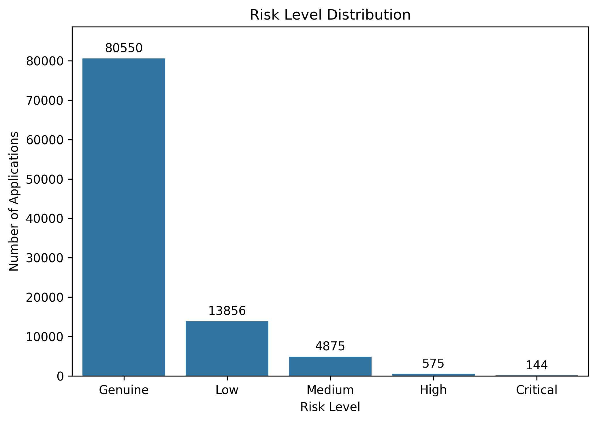
</p>

This visualization shows the distribution of internship applications across different fraud risk levels based on their fraud scores.

### Key Observations

- Most applications are classified as **Genuine**, indicating normal application behaviour.
- **Low Risk** represents the largest category among suspicious applications.
- **Medium**, **High**, and **Critical Risk** applications occur less frequently.
- Overall, the dataset is dominated by genuine applications, while high-risk cases represent only a small portion of the data.

---

## Individual Fraud Reason Distribution

<p align="center">
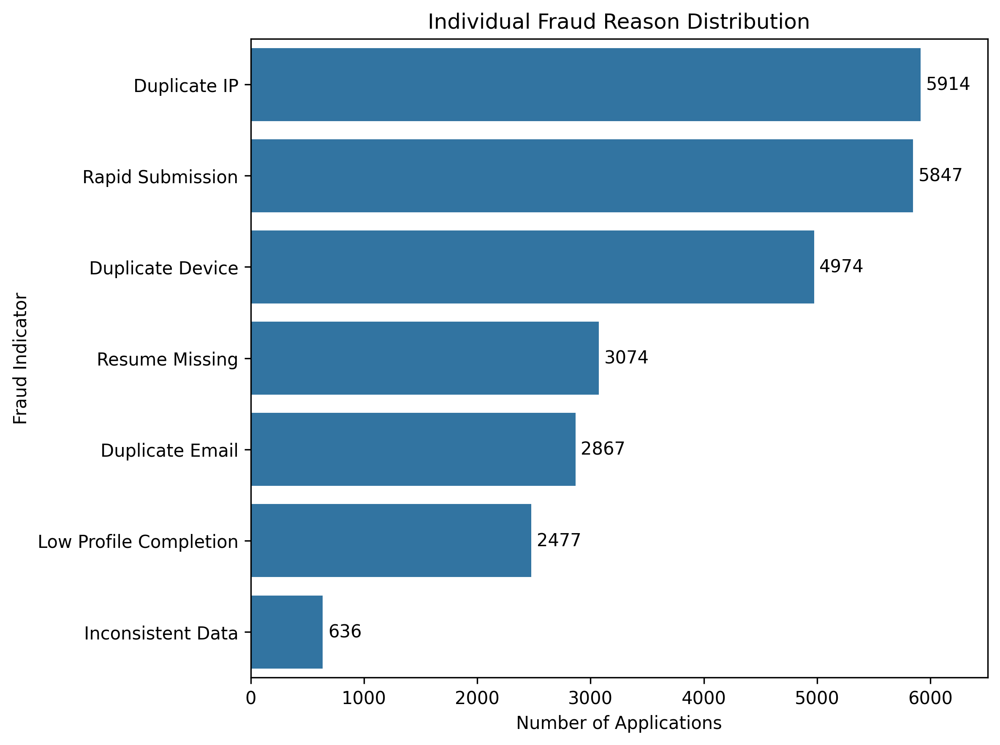
</p>

This visualization summarizes the frequency of individual fraud indicators detected in internship applications.

### Key Observations

- **Duplicate IP** is the most frequently observed fraud indicator.
- **Rapid Submission** and **Duplicate Device** are also common suspicious behaviours.
- **Resume Missing**, **Duplicate Email**, and **Low Profile Completion** occur less frequently.
- The distribution highlights which fraud indicators contribute most to suspicious applications.

---

## Duplicate Email Analysis

<p align="center">

</p>

This analysis examines internship applications associated with duplicate email addresses.

### Key Observations

- Duplicate email addresses represent a relatively small portion of the dataset.
- Most applications use unique email addresses.
- Duplicate email records may indicate repeated submissions or suspicious applicant behaviour.
- Verification using the original dataset confirms consistency between duplicate email records and the assigned fraud indicator.

---

## Duplicate IP Analysis

<p align="center">
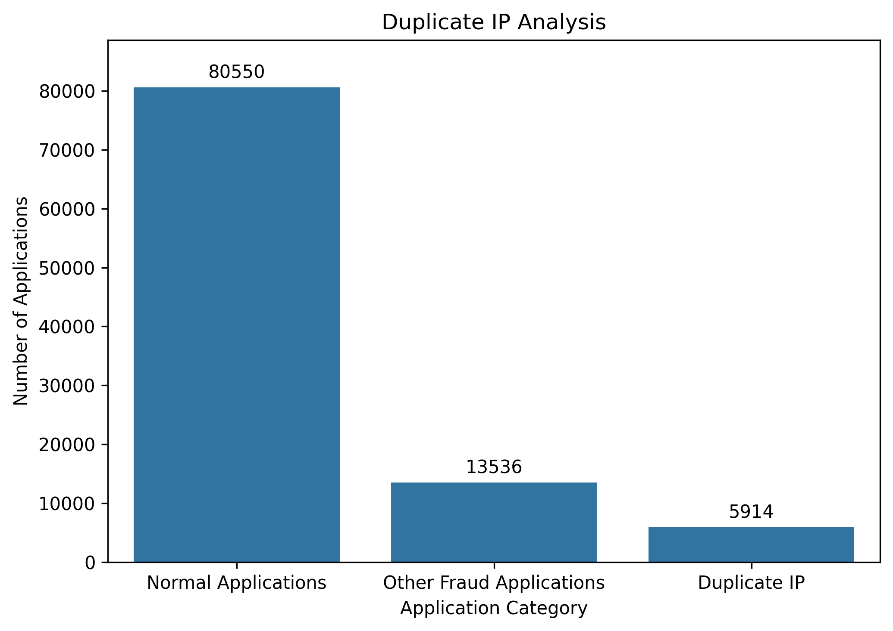
</p>

This visualization analyzes applications submitted from duplicate IP addresses.

### Key Observations

- Duplicate IP is the most common fraud indicator in the dataset.
- Most applications still originate from unique IP addresses.
- Repeated IP addresses may indicate shared networks or suspicious submission activity.
- The analysis validates the fraud indicator using the original IP address records.

---

## Duplicate Device Analysis

<p align="center">
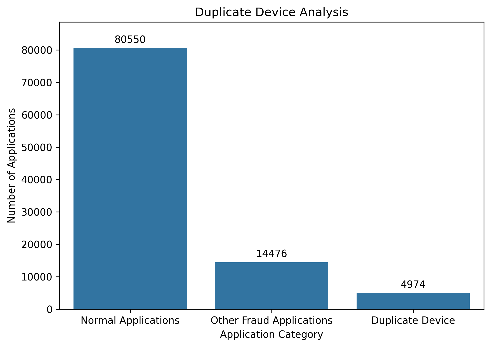
</p>

This visualization examines internship applications submitted using duplicate device IDs. Repeated device usage is considered an important behavioural indicator that may suggest multiple applications originating from the same device.

### Key Observations

- Most applications were submitted using unique devices.
- A smaller number of applications were associated with duplicate device IDs.
- Repeated device usage may indicate multiple submissions from the same applicant or shared devices.
- This indicator contributes to the overall fraud analysis and risk assessment.

---

## Rapid Submission Analysis

<p align="center">

</p>

This visualization analyzes applications submitted within unusually short time intervals. Rapid submissions may indicate automated activity or repeated application attempts.

### Key Observations

- Most applicants followed normal submission behaviour.
- A smaller proportion of applications were submitted rapidly.
- Rapid submissions represent one of the behavioural fraud indicators used in this project.
- These records were considered during the overall fraud analysis.

---

## Resume Missing Analysis

<p align="center">
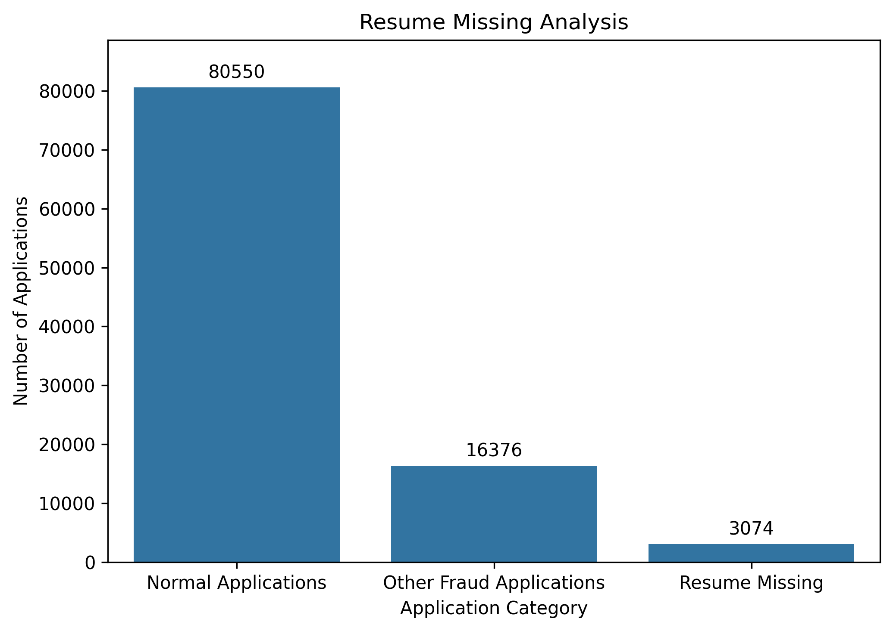
</p>

This chart compares applications with uploaded resumes against those submitted without a resume.

### Key Observations

- The majority of applicants uploaded a resume during the application process.
- Only a small proportion of applications were submitted without a resume.
- Missing resumes contribute to the overall fraud assessment.
- Resume availability provides additional insight into application completeness.

---

## Low Profile Completion Analysis

<p align="center">

</p>

This visualization highlights applications with low profile completion percentages, helping identify incomplete applicant profiles.

### Key Observations

- Most applicants completed a large portion of their profiles.
- A relatively small number of applications had low profile completion.
- Incomplete profiles may indicate lower application quality or suspicious behaviour.
- This feature was included as one of the fraud indicators.

---

## Inconsistent Data Analysis

<p align="center">
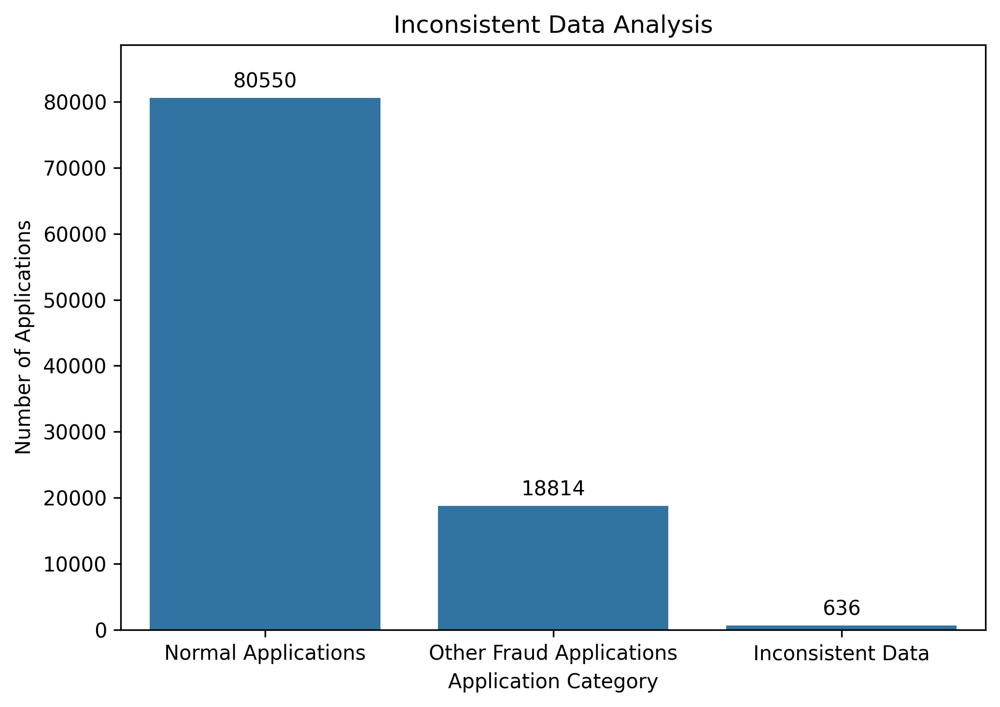
</p>

This visualization presents applications containing inconsistent applicant information based on the predefined fraud indicators.

### Key Observations

- Most applications contain consistent information.
- Only a limited number of applications were flagged for inconsistent data.
- Inconsistent information is treated as a behavioural fraud indicator.
- This analysis helps identify records requiring additional verification.

---

## Multiple Fraud Indicator Analysis

<p align="center">
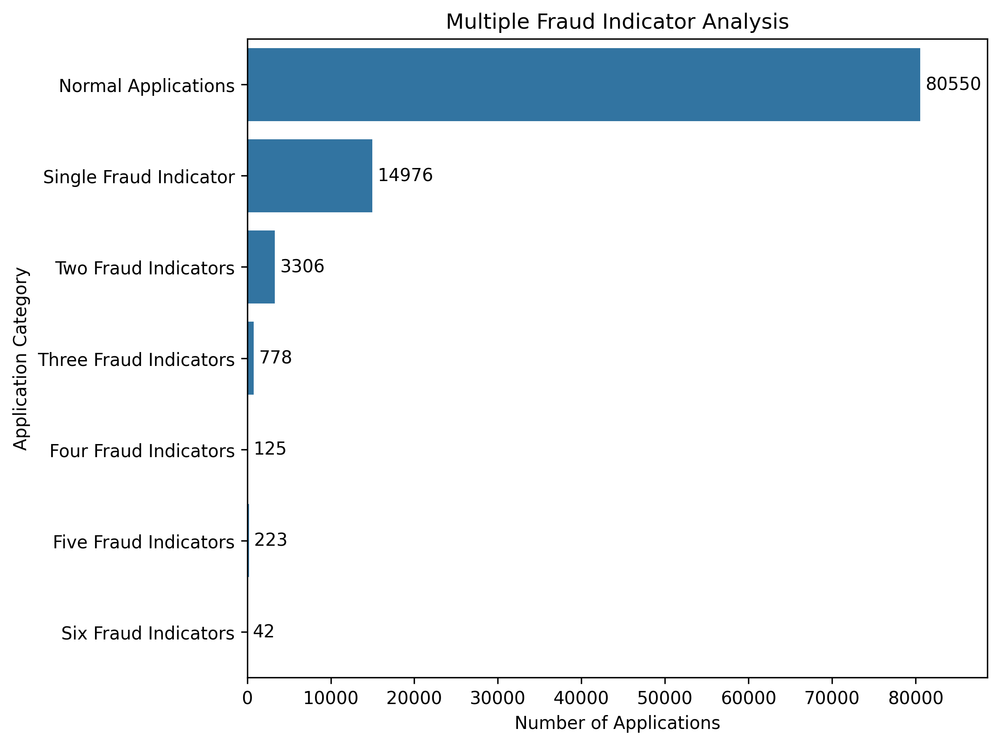
</p>

This visualization shows the number of fraud indicators associated with each application, providing an overview of overall application risk.

### Key Observations

- Most applications contain few or no fraud indicators.
- The number of applications decreases as the count of fraud indicators increases.
- Applications with multiple fraud indicators are more likely to exhibit suspicious behaviour.
- The combined fraud indicators support the anomaly detection process used later in the project.

---

# Feature-wise Fraud Analysis

This section examines how fraudulent applications are distributed across different applicant characteristics, including departments, internship tracks, education levels, and experience levels. The analysis helps identify applicant groups with relatively higher fraud activity.

---

## Department-wise Fraud Analysis

<p align="center">
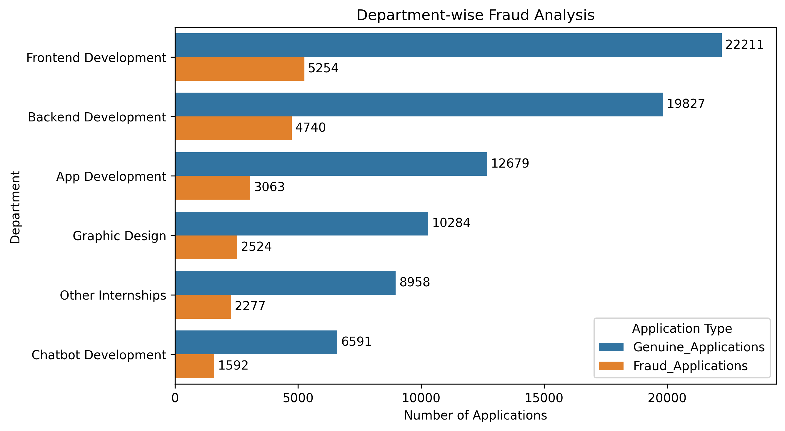
</p>

This visualization compares genuine and fraudulent internship applications across different departments.

### Key Observations

- **Frontend Development** received the highest number of internship applications.
- **Chatbot Development** recorded the lowest number of applications.
- Fraudulent applications are present across all departments.
- The fraud rate varies by department, indicating that some departments experience relatively higher suspicious activity than others.

---

## Internship Track-wise Fraud Analysis

<p align="center">
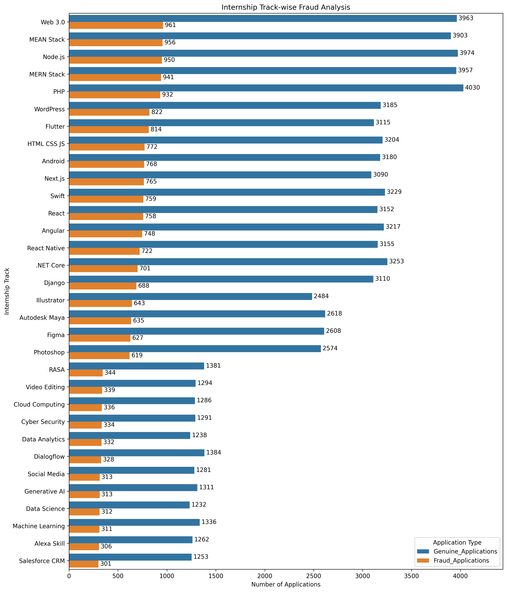
</p>

This visualization compares genuine and fraudulent applications across different internship tracks.

### Key Observations

- Fraudulent applications are distributed across all internship tracks.
- Some internship tracks receive noticeably more fraudulent applications than others.
- Tracks with higher application volumes generally contain more suspicious applications.
- Comparing fraud rates provides a clearer understanding of fraud intensity across different tracks.

---

## Education Level Analysis

<p align="center">
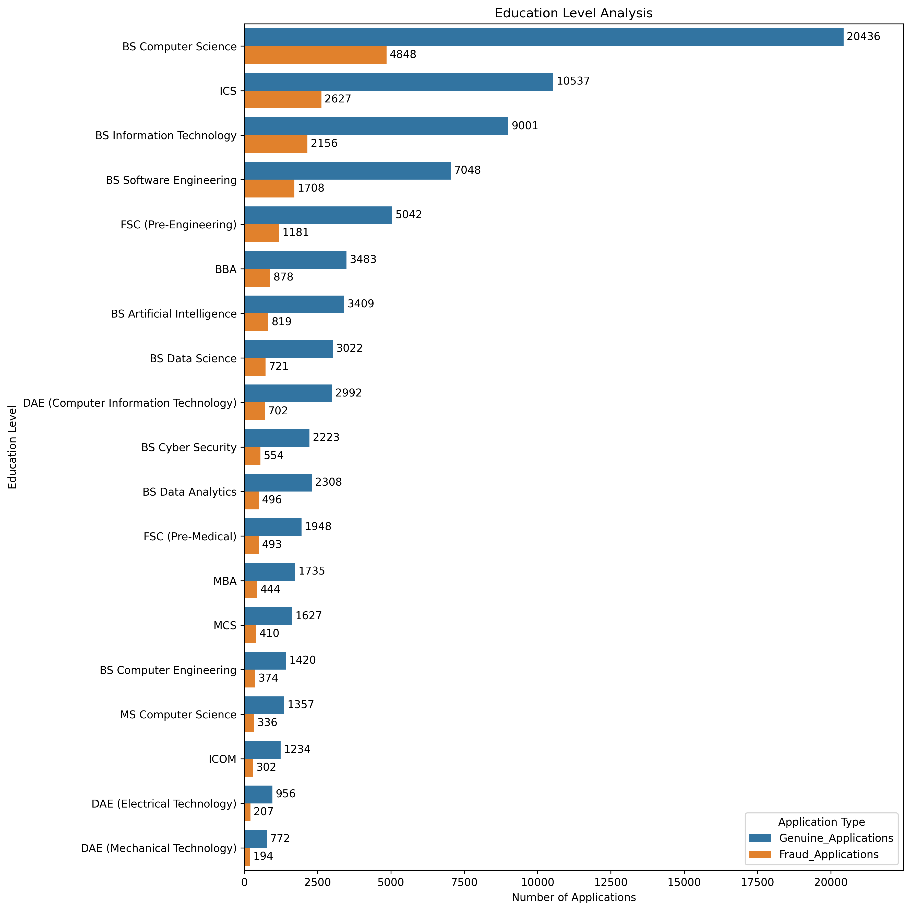
</p>

This visualization compares application distribution across different education levels.

### Key Observations

- **BS Computer Science** contributes the highest number of internship applications.
- **ICS** and **BS Information Technology** also represent large applicant groups.
- Genuine applications exceed fraudulent applications across every education category.
- Fraud rates vary slightly among different educational backgrounds.

---

## Experience Level Analysis

<p align="center">
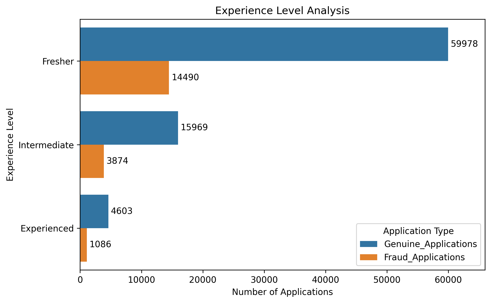
</p>

This visualization analyzes genuine and fraudulent applications based on applicants' experience levels.

### Key Observations

- **Freshers** represent the largest applicant group.
- **Intermediate** applicants form the second largest category.
- **Experienced** applicants account for the smallest number of applications.
- Fraudulent applications are observed across all experience levels, with Freshers contributing the largest share due to their higher application volume.

---

# Numerical Feature Analysis

This section analyzes the distribution of key numerical features in the dataset, including **CGPA**, **Profile Completion**, and **Submission Gap**. These visualizations provide insights into applicant behaviour and help identify unusual patterns before applying machine learning algorithms.

---

## CGPA Distribution Analysis

<p align="center">

</p>

This visualization presents the distribution of applicants' CGPA values using a histogram and box plot to examine academic performance and identify potential outliers.

### Key Observations

- Most applicants have CGPA values between **3.0 and 4.0**, indicating generally strong academic performance.
- The average CGPA is approximately **3.35**.
- A small number of applicants have unusually low CGPA values, which appear as outliers in the box plot.
- Overall, the dataset represents a realistic academic performance distribution.

---

## Profile Completion Analysis

<p align="center">
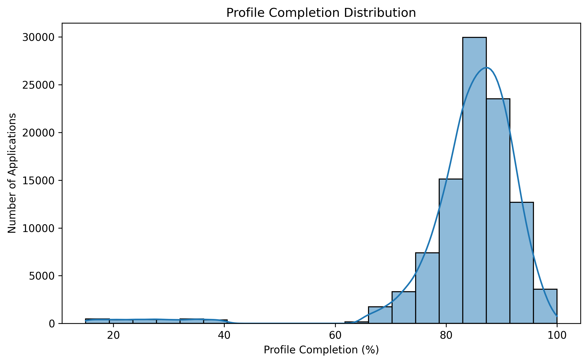
</p>

This visualization analyzes the percentage of profile completion for internship applicants through a histogram and box plot.

### Key Observations

- Most applicants have profile completion values between **80% and 100%**.
- The average profile completion is approximately **84%**.
- A small number of applications contain unusually low profile completion values.
- Lower profile completion contributes to the fraud analysis as one of the behavioural indicators.

---

## Submission Gap Analysis

<p align="center">
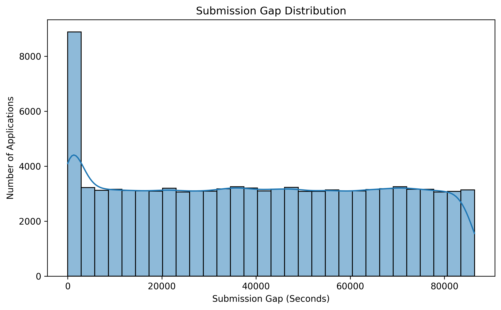
</p>

This visualization examines the time interval between consecutive internship application submissions using a histogram and box plot.

### Key Observations

- Submission gaps range from **2 seconds to 24 hours**, indicating diverse applicant behaviour.
- Most applications follow normal submission intervals.
- A small concentration of applications shows extremely short submission gaps, corresponding to the **Rapid Submission** fraud indicator.
- The box plot highlights several lower-end outliers associated with unusually fast submissions.

---

# Machine Learning for Fraud Detection

After completing the exploratory data analysis, the dataset was prepared for machine learning. A separate copy of the cleaned dataset was created to preserve the original data while performing feature engineering and model development.

The machine learning pipeline included feature engineering, feature selection, feature encoding, feature scaling, anomaly detection using Isolation Forest, and clustering using K-Means.

---

## Preparing the Machine Learning Dataset

A dedicated machine learning dataset was created from the cleaned data to ensure that preprocessing and model training did not modify the original dataset.

---

## Feature Engineering

Several fraud-related behavioural features were engineered from the original dataset to improve anomaly detection and clustering performance. These engineered features represent suspicious application patterns such as duplicate identities, repeated submissions, incomplete profiles, and inconsistent applicant information.

### Engineered Features

- Duplicate_Email
- Duplicate_IP
- Duplicate_Device
- Rapid_Submission
- Resume_Missing
- Low_Profile_Completion
- Inconsistent_Data

### Summary

- Seven binary fraud-related features were created.
- These features enhanced the representation of suspicious applicant behaviour.
- The engineered features were used only during machine learning and were not part of the original dataset.

---

## Feature Selection

After feature engineering, only the most relevant features were selected for model development. Identifier columns and non-informative attributes were excluded to improve model performance and reduce unnecessary complexity.

### Summary

- A total of **19 features** were selected for machine learning.
- The selected dataset includes both numerical and categorical features.
- The original fraud label (**Is_Fraud**) was excluded from model training and retained only for evaluation.

---

## Feature Encoding

Categorical variables were converted into numerical representations using **One-Hot Encoding**, allowing the machine learning algorithms to process non-numeric information effectively.

### Summary

- Eight categorical features were successfully encoded.
- One-Hot Encoding preserved category independence without introducing ordinal relationships.
- The encoded dataset became suitable for machine learning algorithms.

---

## Feature Scaling

Continuous numerical features were standardized using **StandardScaler** to ensure that variables with different ranges contributed equally during model training.

### Summary

- Continuous numerical features were standardized.
- Binary engineered features remained unchanged.
- Feature scaling improved the performance of distance-based machine learning algorithms.

---

# Isolation Forest

Isolation Forest was applied to identify anomalous internship applications based on behavioural patterns without using fraud labels during training.

### Prediction Summary

<p align="center">
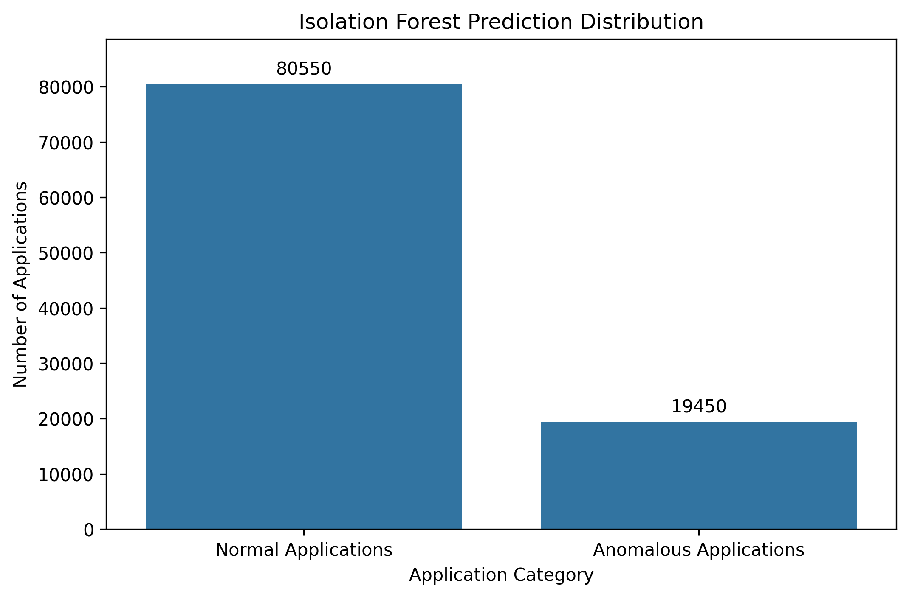
</p>

### Key Observations

- The model classified **80,550 applications** as normal.
- **19,450 applications** were identified as anomalous.
- The detected anomaly ratio closely matched the configured contamination value.
- The results indicate that Isolation Forest successfully identified a subset of potentially suspicious applications.

---

### Model Evaluation

<p align="center">
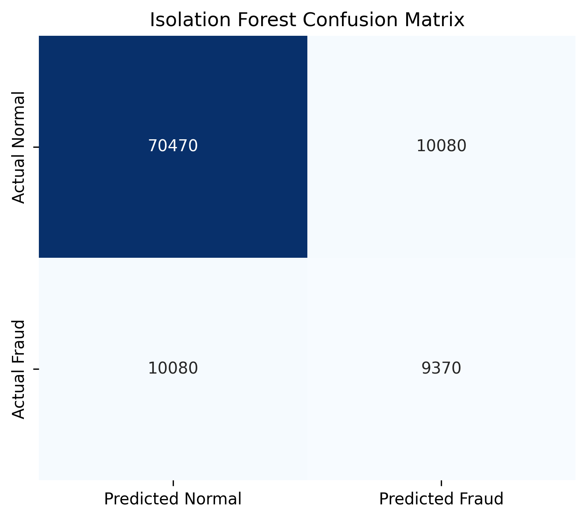
</p>

### Key Observations

- The model achieved an overall accuracy of approximately **80%**.
- Most genuine applications were correctly classified.
- A portion of fraudulent applications was successfully detected as anomalies.
- The confusion matrix provides a detailed comparison between predicted anomalies and the original fraud labels.

---

# K-Means Clustering

K-Means Clustering was applied to group internship applications based on feature similarity without using the original fraud labels during training. Unlike Isolation Forest, which directly detects anomalies, K-Means helps discover hidden behavioural patterns within the dataset.

---

## Elbow Method

<p align="center">
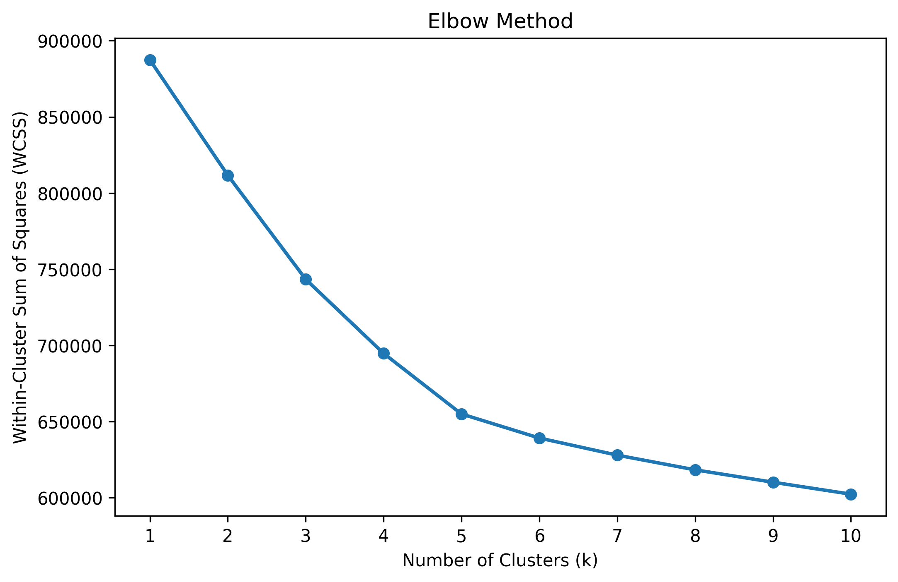
</p>

The Elbow Method was used to estimate the optimal number of clusters by analyzing the Within-Cluster Sum of Squares (WCSS) across different values of **k**.

### Key Observations

- WCSS decreases as the number of clusters increases.
- The improvement becomes less significant after a certain point.
- The elbow is not sharply defined, making the optimal value difficult to determine using this method alone.
- Therefore, Silhouette Analysis was used to validate the final number of clusters.

---

## Silhouette Analysis

<p align="center">

</p>

Silhouette Analysis evaluates clustering quality by measuring how well each observation fits within its assigned cluster compared to neighbouring clusters.

### Key Observations

- The highest Silhouette Score was obtained for **k = 3**.
- Clustering quality gradually decreases for larger values of **k**.
- The results support selecting **three clusters** for K-Means.
- The Silhouette Analysis confirms the findings of the Elbow Method.

---

## Cluster Summary

<p align="center">
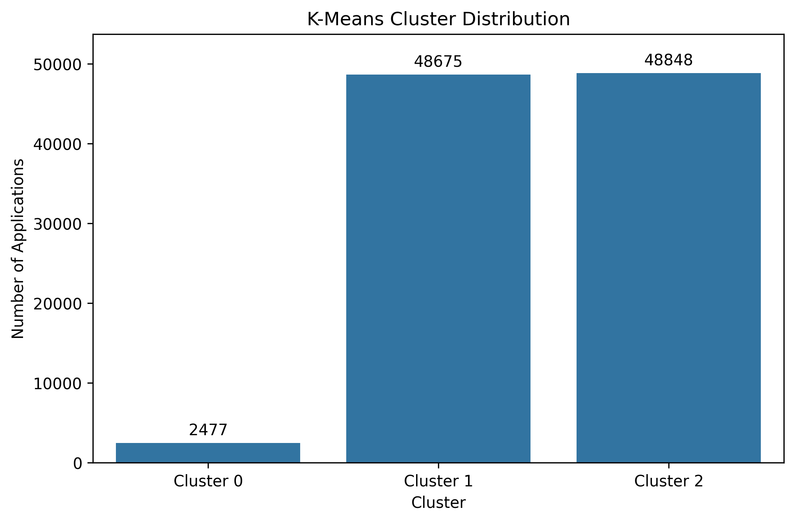
</p>

After selecting the optimal number of clusters, the K-Means model grouped all internship applications into three distinct clusters.

### Key Observations

- The dataset was divided into **three clusters**.
- One cluster contains significantly fewer applications than the other two.
- The remaining two clusters contain nearly equal numbers of applications.
- The distribution indicates that applicants naturally form distinct behavioural groups.

---

## PCA Visualization

<p align="center">
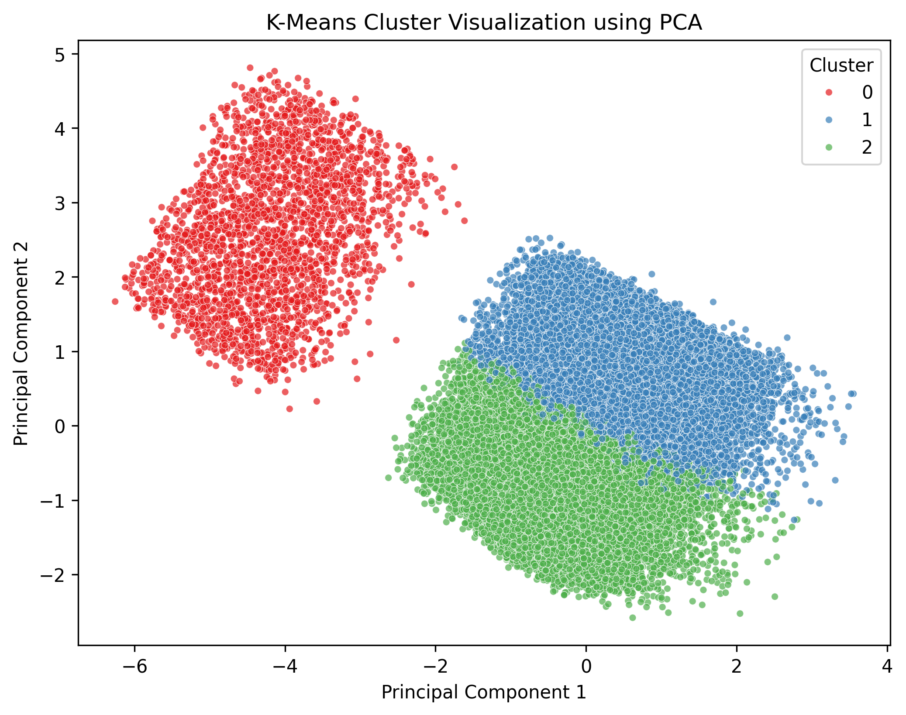
</p>

Principal Component Analysis (PCA) was used to reduce the high-dimensional feature space into two dimensions for visualization.

### Key Observations

- PCA provides a clear two-dimensional representation of the generated clusters.
- **Cluster 0** is clearly separated from the remaining clusters.
- **Clusters 1 and 2** are positioned close to each other with partial overlap.
- The visualization demonstrates that K-Means successfully identified distinct behavioural groups.

---

## Cluster vs Actual Fraud

<p align="center">
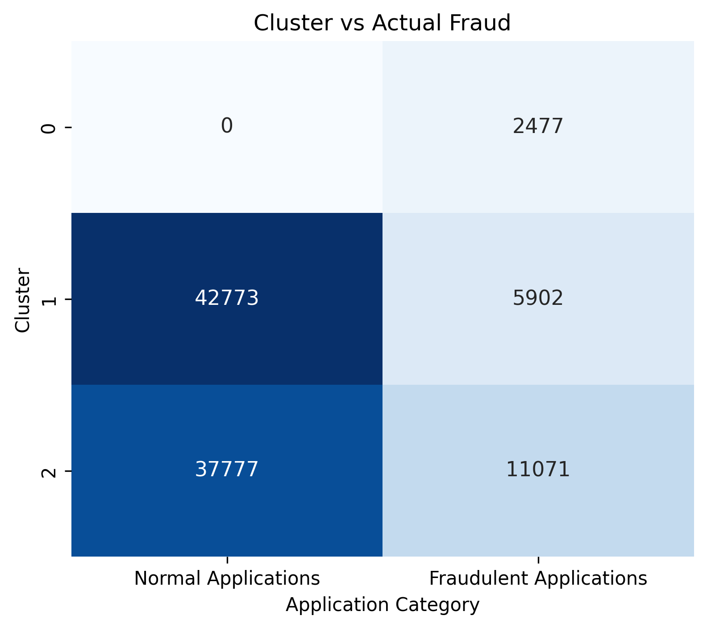
</p>

Although K-Means was trained without fraud labels, the discovered clusters were compared with the original fraud labels to better understand the distribution of normal and fraudulent applications.

### Key Observations

- **Cluster 0** consists entirely of fraudulent applications.
- **Cluster 1** is dominated by genuine applications with a smaller proportion of fraud cases.
- **Cluster 2** contains both genuine and fraudulent applications.
- The comparison shows that K-Means successfully isolated a highly suspicious applicant group despite using an unsupervised learning approach.

---

## K-Means Clustering Findings

The K-Means clustering analysis successfully grouped internship applications into meaningful behavioural clusters without using fraud labels during training.

### Summary

- The Elbow Method and Silhouette Analysis identified **three** as the optimal number of clusters.
- K-Means partitioned the dataset into three distinct applicant groups.
- PCA visualization confirmed meaningful cluster separation.
- Post-clustering analysis showed that one cluster was composed entirely of fraudulent applications.
- The clustering results demonstrate that applicant behaviour contains identifiable patterns that can support fraud analysis.

---

# Model Comparison

Both machine learning algorithms were trained using the same preprocessed dataset but served different purposes.

| Isolation Forest | K-Means Clustering |
|------------------|--------------------|
| Detects anomalies directly | Groups similar applications into clusters |
| Produces Normal / Anomaly predictions | Produces cluster assignments |
| Evaluated using Classification Report and Confusion Matrix | Evaluated using Elbow Method, Silhouette Analysis, and cluster interpretation |
| Best suited for anomaly detection | Best suited for behavioural pattern discovery |

Overall, **Isolation Forest** is more suitable for directly detecting suspicious applications, while **K-Means Clustering** provides additional insights into applicant behaviour by discovering naturally occurring groups within the dataset.

---

# Conclusion

This project developed an end-to-end unsupervised machine learning pipeline for detecting suspicious internship applications. The workflow included data preprocessing, exploratory data analysis, feature engineering, feature selection, feature encoding, feature scaling, anomaly detection using Isolation Forest, and clustering using K-Means.

Isolation Forest successfully identified anomalous applications and was evaluated using classification metrics and a confusion matrix. K-Means Clustering grouped applications into meaningful behavioural clusters, with one cluster consisting entirely of fraudulent applications after comparison with the original fraud labels.

The results demonstrate that combining anomaly detection with clustering provides valuable insights into fraudulent application behaviour and highlights the potential of unsupervised machine learning for supporting internship recruitment systems.

---

# Technologies Used

The project was developed using Python and widely used open-source libraries for data analysis, visualization, preprocessing, anomaly detection, clustering, and dimensionality reduction.

| Technology | Purpose |
|------------|---------|
| Python | Core programming language |
| Pandas | Data manipulation and analysis |
| NumPy | Numerical computations |
| Matplotlib | Data visualization |
| Seaborn | Statistical visualization |
| Scikit-learn | Machine learning, preprocessing, anomaly detection, clustering, and PCA |
| Jupyter Notebook | Interactive development environment |

---

# Installation

Clone the repository and navigate to the project folder.

```bash
git clone https://github.com/huzaifawaheed2/InterneePK-Data-Analyst-Internship.git

cd InterneePK-Data-Analyst-Internship
cd 03-Fraud-Detection-in-Applications

pip install -r requirements.txt
```

---

# Requirements

Install all required Python libraries using:

```bash
pip install -r requirements.txt
```

The `requirements.txt` file contains all dependencies required to run this project successfully.

---

# How to Run

Follow these steps to reproduce the project.

### 1. Clone the Repository

```bash
git clone https://github.com/huzaifawaheed2/InterneePK-Data-Analyst-Internship.git
```

### 2. Navigate to the Project Folder

```bash
cd InterneePK-Data-Analyst-Internship
cd 03-Fraud-Detection-in-Applications
```

### 3. Install Required Libraries

```bash
pip install -r requirements.txt
```

### 4. Launch Jupyter Notebook

```bash
jupyter notebook
```

### 5. Open the Notebook

```text
notebook/
└── Fraud_Detection_in_Applications.ipynb
```

Run all notebook cells sequentially to reproduce the complete analysis, visualizations, anomaly detection, clustering results, and model evaluation.

---

# Repository Contents

```text
InterneePK-Data-Analyst-Internship/
│
├── 01-Internship-Program-Analysis/
├── 02-Intern-Performance-Prediction/
├── 03-Fraud-Detection-in-Applications/
│   ├── dataset/
│   │   └── raw/
│   │       └── internship_applications_2025.csv
│   │
│   ├── notebook/
│   │   └── Fraud_Detection_in_Applications.ipynb
│   │
│   ├── outputs/
│   │   └── figures/
│   │       ├── 01_risk_level_distribution.png
│   │       ├── ...
│   │       └── 27_cluster_vs_actual_fraud_heatmap.png
│   │
│   ├── README.md
│   └── requirements.txt
│
├── .gitignore
└── README.md
```

---

# Future Improvements

Possible enhancements for this project include:

- Evaluate additional anomaly detection algorithms.
- Experiment with different clustering techniques.
- Develop an interactive dashboard for fraud monitoring.
- Test the framework on real-world internship application datasets.
- Deploy the project as a web-based fraud detection application.

---

# Author

## Muhammad Huzaifa Waheed

Data Analyst | Power BI Developer | QA Engineer

### Connect With Me

- GitHub: [huzaifawaheed2](https://github.com/huzaifawaheed2)
- LinkedIn: [Muhammad Huzaifa Waheed](https://www.linkedin.com/in/muhammad-huzaifa-waheed-70043338b)

---

## ⭐ If you found this project useful, consider giving the repository a star.